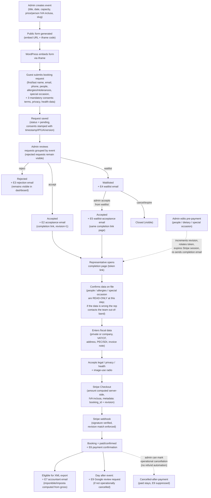
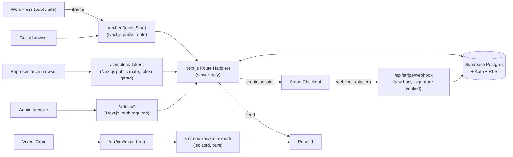

# Cooker Loft V1 — Project Brief

- **Purpose**: define what the Cooker Loft V1 booking management system is, who it serves, the end-to-end flow it must support, and the production stack it runs on.
- **Scope**: V1 only. This document is the single source of truth for what V1 ships.
- **Out of scope**: see [NON_GOALS.md](./NON_GOALS.md).
- **Owner**: Cooker Loft technical lead.
- **Last updated**: 2026-05-20.

---

## 1. Product summary

Cooker Loft is a venue that hosts **private events** (dinners, tastings, private cooking experiences). V1 of the management system handles **booking requests** for those events, from the moment they are published to the moment they are paid and made available for fiscal export.

V1 replaces an ad-hoc, email-based workflow with a controlled pipeline:

1. Admins publish events.
2. Guests submit booking requests through a public form embedded on the WordPress site.
3. Admins triage requests per event (accept, reject, waitlist).
4. The booking representative for each accepted request completes critical data, fiscal data, accepts legal/privacy terms, and pays online.
5. Only Stripe-verified paid bookings are eligible for fiscal XML export, which is sent to the accountant by email.

V1 is production-oriented: it is the system the venue will actually use to take money. It is not a prototype.

## 2. Stakeholders

- **Admin** (Cooker Loft staff): creates events, reviews requests, manages waitlists, triggers fiscal exports. Authenticated.
- **Booking representative** (the person who books on behalf of a group): submits the public request, then later completes the booking and pays. Identified by a secure one-shot link, not by an account.
- **Accountant** (commercialista): receives XML exports by email at a defined cadence. External to the app.
- **WordPress site**: embeds the public request form via iframe. Does not hold business logic.

## 3. End-to-end flow

### Flow notes

- The **request** and the **booking** are conceptually distinct in the database: a request is what arrives from the public form, a booking is what exists once a representative completes it. **At the UI level the team sees a single concept, "Prenotazione", with six visible statuses**: `richiesta ricevuta`, `in lista d'attesa`, `in attesa di pagamento`, `pagata`, `rifiutata`, `pagata · cancellata`. Other underlying states (cancelled / expired / void) are collapsed into a hidden `deleted` bucket and removed from all dashboards and filters. See [STATES.md](./STATES.md) §0 for the mapping and the state machine.
- The **public request form** collects: first name, last name, email, phone, number of people, allergies / intolerances / food needs for the group, special occasion (free text), **and three mandatory consent checkboxes**: terms (`condizioni`), privacy notice, and explicit health-data consent (GDPR art. 9.2.a, required because of allergy/dietary data). Each consent is stamped server-side with timestamp, IP, user-agent, and document version. The event is implicit from the embed URL (`/embed/[slug]`). Fiscal data is **not** collected at this step.
- **Rejected requests stay visible.** They are listed in the admin dashboard grouped by event, filterable by the `rejected` status, available for support/history. **Cancelled / expired / voided** records also remain in the database (for audit) but are hidden from all admin lists and filters; the team-facing way to "delete" a non-paid prenotazione is the unified **Elimina prenotazione** action at the bottom of the detail page, which moves the prenotazione into this hidden bucket. See [STATES.md](./STATES.md) §0 and §9.
- At the **completion** step, the representative **confirms** (does not edit) the request data already on file (people, dietary notes, special occasion). These fields are displayed in read-only form. If they are wrong, the representative contacts the team out-of-band (e.g. email or phone), the team applies an `editBookingPrePayment` from the admin (which rotates the token, expires any prior Stripe session, and re-sends the completion link via the E2 / E5 amend variant), and the representative restarts from the new link. The same model applies before acceptance: an admin can use `editPendingRequest` to amend a pending request before deciding. The completion page itself collects only what was not collected at request time: fiscal data, the full set of consents (terms, privacy, health-data, image-use, clauses 1341/1342), and the optional minor-flow declaration. The UX **reuses** the structure of a previous Cursor project; see [COMPLETION_PAGE_REFERENCE.md](./COMPLETION_PAGE_REFERENCE.md).
- Every requester-visible transition is communicated by email: **E2** (accepted), **E3** (rejected), **E4** (waitlisted), **E5** (accepted from waitlist), **E6** (payment confirmation), **E9** (post-event Google review request). See [EMAILS.md](./EMAILS.md).
- Waitlist acceptance uses a **distinct** template (E5) than direct acceptance (E2), but both link to the **same** `/complete/[token]` page.
- The completion link is a **secure non-guessable token**. It is the only thing that authorizes the completion page. See [SECURITY.md](./SECURITY.md).
- **All prices are IVA inclusa (gross).** `events.price_cents` is the per-person gross price; UI labels show "IVA inclusa" wherever a price is displayed. The Stripe Checkout amount is `events.price_cents * bookings.people`. The XML module derives `imponibile` and `imposta` from the gross at export time according to the configured VAT rate (see [XML_EXPORT.md](./XML_EXPORT.md)). The client never decides the amount.
- **Pre-payment, the admin can edit booking data** (people, dietary notes, special occasion) on the representative's request. The state machine increments `bookings.revision`, rotates the completion token (the old link stops working), expires any prior Stripe Checkout session, and re-sends the completion email. The Stripe webhook only accepts events whose session metadata matches the current `revision`. See [STATES.md](./STATES.md) §5.2 and [SECURITY.md](./SECURITY.md) §6.
- A booking becomes `paid` **only** after the Stripe webhook is verified **and** the revision metadata matches. The frontend cannot set this state. See [STATES.md](./STATES.md) and [SECURITY.md](./SECURITY.md).
- **Paid bookings can be marked as operationally cancelled by the team.** This is a flag, not a state transition off `paid`. It triggers no refund and no SDI/credit-note action. It suppresses the post-event review email (E9). **The marker is definitive in V1**: the admin UI does not expose any "undo cancellation" affordance once it has been set. Refunds and credit notes are handled manually out-of-band. See [STATES.md](./STATES.md) §6.
- **The day after an event**, paid bookings that are not operationally cancelled receive **E9** (Google review request). One email per booking, idempotent, gated by `app_settings.review_url`.

## 4. Stack

| Concern              | Choice                                                                 |
|----------------------|------------------------------------------------------------------------|
| Application          | Next.js (App Router) + TypeScript                                      |
| UI                   | Tailwind CSS + shadcn/ui                                               |
| Forms / validation   | React Hook Form + Zod (shared schemas client/server)                   |
| Database             | Supabase (Postgres)                                                    |
| Auth                 | Supabase Auth (email/password for admins, no public accounts in V1)    |
| Row-level security   | Supabase RLS on all tables                                             |
| Email                | Resend (transactional + accountant export delivery)                    |
| Payments             | Stripe Checkout (hosted) + Stripe webhook                              |
| Deploy               | Vercel (Edge/Node runtime as appropriate per route)                    |
| Background work      | Vercel Cron (for periodic XML export reminders/jobs)                   |
| Fiscal XML           | Isolated internal module, no third-party fiscal SaaS in V1             |

### Why these choices

- **Next.js + TypeScript on Vercel**: first-class deployment, server actions / route handlers, edge-friendly. Strong typing across API and UI reduces state-machine bugs.
- **Supabase**: managed Postgres + Auth + RLS in one place. RLS lets us enforce admin-only access at the database layer, not just in the app.
- **Resend**: simple, reliable transactional API with React Email support.
- **Stripe Checkout**: hosted payment page minimizes our PCI surface; webhook is the only source of truth for `paid`.
- **Vercel Cron**: enough for V1's periodic accountant export. No external scheduler needed.

## 5. Deployment topology

All secrets (Supabase service role key, Stripe secret key, Stripe webhook secret, Resend API key) live as **server-only** environment variables on Vercel. They are never exposed via `NEXT_PUBLIC_*`.

## 6. V1 success criteria

V1 is successful when **all** of the following are true:

1. An admin can create an event (starts as `draft`, fully editable; can be published immediately or later) and obtain a public embed URL and ready-to-paste iframe snippet. **Events are mutable only while `draft`; once `published` they are immutable** (to change anything, archive and re-create). Prices are stored and displayed as **IVA inclusa**.
2. A guest can submit a booking request from the embedded form on WordPress, collecting first name, last name, email, phone, people, dietary notes, special occasion, and accepting the **three mandatory consent checkboxes** (terms, privacy, explicit health-data). The request appears in the admin dashboard under the correct event.
3. An admin can accept, reject, or waitlist any request. Each decision triggers the corresponding transactional email: **E2** (accepted), **E3** (rejected — fixed body, the admin's reason is never shared with the requester), **E4** (waitlisted). **Rejected requests remain visible in the dashboard** and are filterable. Cancelled/expired/voided records are hidden from the UI and reachable only through the unified **Elimina prenotazione** action at the bottom of the prenotazione detail page.
4. An admin can later accept a waitlisted request; **the UI requires an explicit double-confirmation dialog before promoting from the waitlist**. On confirm this triggers **E5** (accepted from waitlist) with a completion link that leads to the same completion page as E2.
5. The representative can open the completion link, **confirm** the pre-filled critical data (people, dietary notes, special occasion) **as read-only**, enter fiscal data, accept the full set of consents (per [COMPLETION_PAGE_REFERENCE.md](./COMPLETION_PAGE_REFERENCE.md)), and pay through Stripe Checkout. If the pre-filled data is wrong, the representative contacts the team and the team edits it from the admin (which re-sends the completion link). The completion page UX reuses the structure of the previous project under `reference/oldPage/`.
6. **Before acceptance**, the admin can edit a `pending` request in place (people, dietary notes, special occasion) via `editPendingRequest`; no revision rotation, no email, no Stripe (none of these exist yet). **Before payment**, on a booking already created, the admin can edit the same fields via `editBookingPrePayment`. The system increments the booking revision, rotates the completion token (the old link stops working), expires any prior Stripe Checkout session, and re-sends the completion email. The Stripe webhook ignores events bound to an obsolete revision.
7. A booking is marked `paid` **only** after the Stripe webhook has been received, its signature verified, **and** its session metadata matches the current `bookings.revision`. The representative receives **E6** (payment confirmation).
8. Paid bookings appear in a "ready for fiscal export" list. **The team can mark a paid booking as operationally cancelled.** This flag suppresses the post-event review email (E9) and does **not** trigger any refund / SDI / credit-note automation. The action is **definitive in V1**: there is no "undo" affordance once the marker is set.
9. An admin can trigger (or schedule) an XML export of paid bookings, which is emailed to the accountant as **E7**. The XML is shaped against the accountant's sample at `reference/xml/fattura reference.xml` (schema FPR12, TipoDocumento `TD01`, prices treated as IVA inclusa with `imponibile`/`imposta` computed at export time).
10. **The day after each event**, paid and not-operationally-cancelled bookings receive **E9** (Google review request), at most once per booking.
11. No secret keys are reachable from the browser bundle.
12. No code path in the frontend can set a booking to `paid`.
13. The XML generator lives in a single isolated module with no UI imports.

## 7. Non-goals

See [NON_GOALS.md](./NON_GOALS.md). The most important V1 exclusions:

- No individual participant flow. All declarations are made by the booking representative.
- No automatic refunds.
- No automatic cancellation / recesso workflow.
- No automatic SDI submission.
- No Fatture in Cloud integration.
- No e-signature.
- No advanced reminders or analytics.

## 8. Hard rules (binding for all V1 work)

These are reproduced verbatim from the brief and are enforced across all docs and code:

- Do not expose secrets in frontend code.
- Admin dashboard must require authentication.
- Public completion links must use secure non-guessable tokens.
- Payment amount must be calculated server-side from database values.
- Frontend must never set a booking as paid.
- Paid/confirmed status can only be set by verified Stripe webhook.
- XML generation must be isolated in a dedicated module.
- XML fiscal correctness must be documented as requiring accountant/legal validation.
- Keep business logic outside UI components.
- Centralize booking state transitions.
- Keep code modular and scalable.

## 9. Related documents

- [NON_GOALS.md](./NON_GOALS.md) — what V1 explicitly does **not** do.
- [STATES.md](./STATES.md) — booking lifecycle and transitions.
- [DB_SCHEMA.md](./DB_SCHEMA.md) — Postgres schema, RLS, indexes.
- [EMAILS.md](./EMAILS.md) — Resend templates and delivery rules.
- [SECURITY.md](./SECURITY.md) — auth, secrets, tokens, webhook verification.
- [XML_EXPORT.md](./XML_EXPORT.md) — fiscal XML module boundary and disclaimer.
- [COMPLETION_PAGE_REFERENCE.md](./COMPLETION_PAGE_REFERENCE.md) — completion page UX, reuse rules, dependency on `reference/oldPage/`.
- [TASK_PLAN.md](./TASK_PLAN.md) — phased implementation plan.
- [TEST_PLAN.md](./TEST_PLAN.md) — unit, integration, e2e, and manual QA plan.
