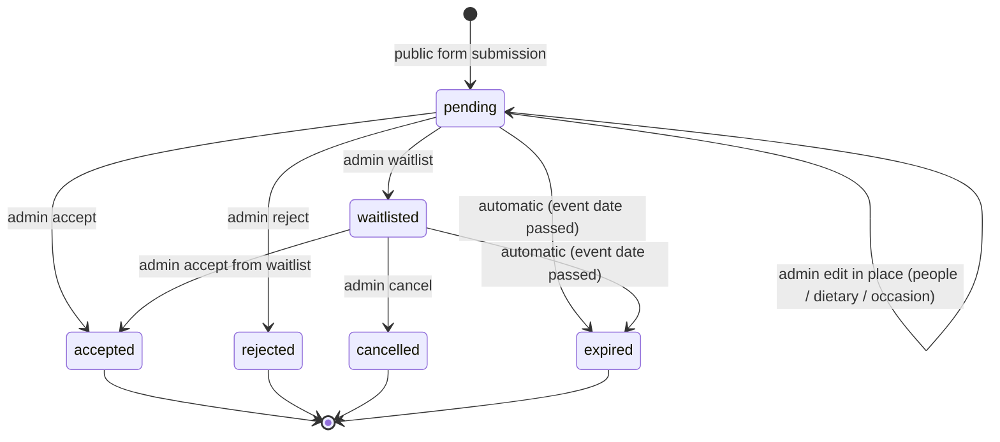
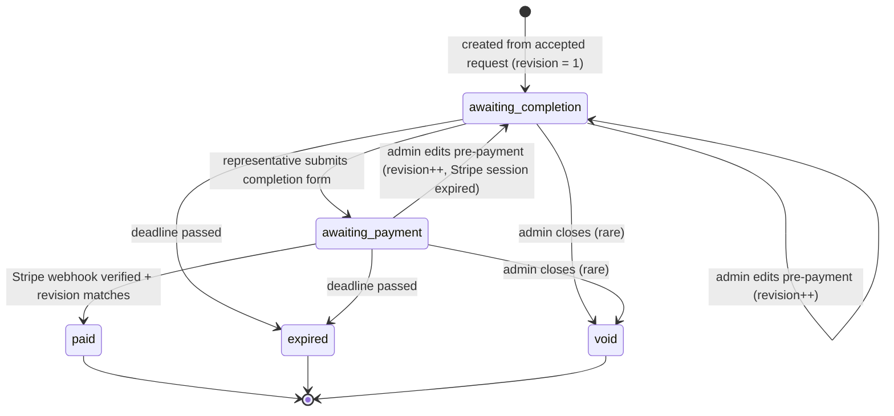
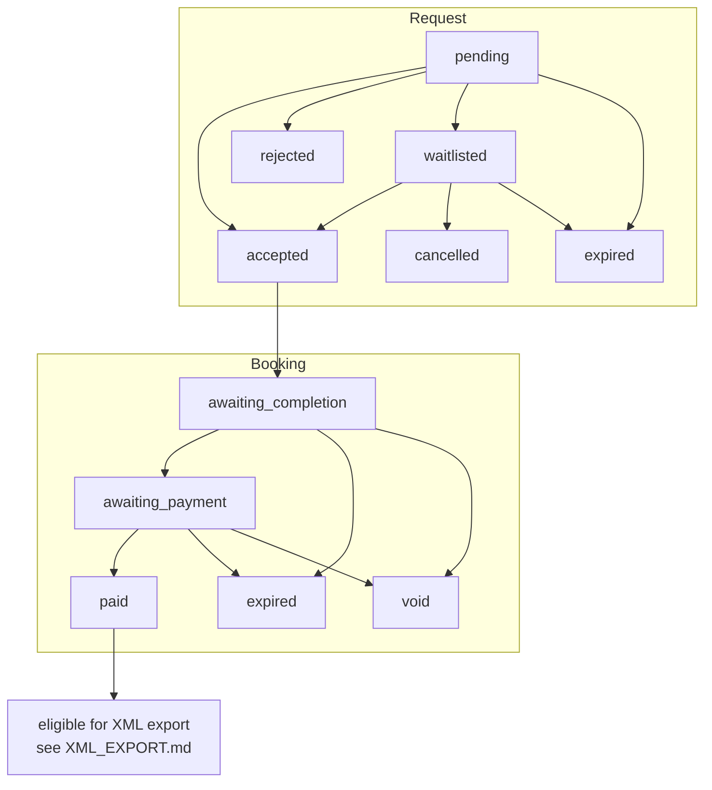
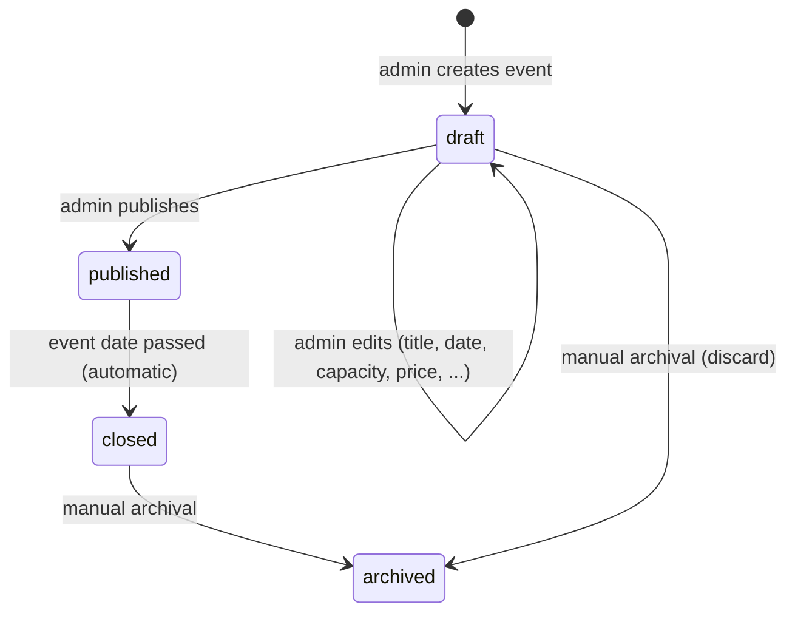

# Cooker Loft V1 — Booking States & Transitions

- **Purpose**: define the single, authoritative lifecycle for booking requests and bookings, the allowed transitions between states, who can trigger them, and what side effects each transition has.
- **Scope**: the request-to-paid lifecycle, the waitlist sub-flow, pre-payment admin edits (revision/token rotation), and the operational paid-cancellation marker. Fiscal export and email contents are referenced but defined in their own docs.
- **Out of scope**: automatic refund workflows and SDI/credit-note workflows (see [NON_GOALS.md](./NON_GOALS.md)).
- **Owner**: Cooker Loft technical lead.
- **Last updated**: 2026-05-20.

---

## 0. UI-level statuses vs underlying data states

The team dashboard never shows the granular underlying states of `booking_requests` and `bookings` separately. The UI collapses them into a single concept (`Prenotazione`) and exposes **six visible statuses** to the team:

| UI status              | Italian label                 | Underlying mapping                                                                       |
|------------------------|-------------------------------|------------------------------------------------------------------------------------------|
| `received`             | Richiesta ricevuta            | `booking_requests.status = pending`                                                      |
| `waitlisted`           | In lista d'attesa             | `booking_requests.status = waitlisted`                                                   |
| `to_pay`               | In attesa di pagamento        | `booking_requests.status = accepted` AND `bookings.status IN (awaiting_completion, awaiting_payment)` |
| `paid`                 | Pagata                        | `bookings.status = paid` AND `cancelled_after_payment_at IS NULL`                        |
| `rejected`             | Rifiutata                     | `booking_requests.status = rejected`                                                     |
| `paid_cancelled`       | Pagata · cancellata           | `bookings.status = paid` AND `cancelled_after_payment_at IS NOT NULL`                    |

Any other underlying combination (`booking_requests.status IN (cancelled, expired)`, `bookings.status IN (expired, void)`) is folded into a hidden `deleted` UI bucket: those records remain in the database for audit/forensic purposes but are **not** listed in dashboards, tables, or filters. The team's "Elimina prenotazione" action is the single user-facing way to push a non-paid prenotazione into the `deleted` bucket.

The state machine continues to operate on the granular states defined below; the UI projection is purely a display concern.

## 1. Two related entities

V1 uses two related records to model the lifecycle:

- **`booking_requests`**: raised by the public form. Holds the initial intent (event, party size, requester contact info). This is what admins triage.
- **`bookings`**: created when a request is **accepted**. Holds the durable booking, including the completion token, fiscal profile (once filled), payment record, and the final `paid` state.

Keeping them separate has two benefits:
- Rejected/waitlisted requests do not pollute the bookings table.
- The fiscal-relevant entity (`bookings`) only exists for things the venue actually committed to.

See [DB_SCHEMA.md](./DB_SCHEMA.md) for column-level details.

## 2. Hard rules

These are non-negotiable and any code that touches state must respect them:

1. **All transitions go through a single server-side module** (working name: `bookingStateMachine`). UI components, route handlers, and webhooks call into this module; they never `UPDATE bookings SET status = ...` directly.
2. **`paid` can only be set by the verified Stripe webhook handler.** No admin action, no client request, no manual override sets `paid` in V1.
3. **Payment amounts are computed server-side** from `events.price_cents * bookings.people`. The state machine refuses to create a Stripe session if those values are missing or inconsistent.
4. **Every transition writes an entry to `audit_log`** with: actor (admin user id, system, or webhook), from-state, to-state, reason, and a timestamp.
5. **Transitions are idempotent.** Re-running the same transition with the same input must not duplicate side effects (e.g. re-sending acceptance emails, double-creating Stripe sessions). This is enforced by checking the current state before acting.
6. **Side effects (email, Stripe session creation, audit log) run in the same logical operation as the state change.** Where possible, this is a Postgres transaction; where Stripe/Resend are involved (external systems), we use idempotency keys and "outbox-style" guards.
7. **`bookings.revision` is monotonically increasing.** It starts at `1` on creation and is incremented by `editBookingPrePayment(...)`. Stripe session metadata always carries `booking_id` + `booking_revision`. The webhook handler refuses to mark `paid` unless `metadata.booking_revision === bookings.revision` at the time of processing. Obsolete sessions are recorded in `audit_log` and discarded.
8. **The operational cancellation marker on `paid` bookings is not a status transition.** A paid booking stays `paid`. The marker (`bookings.cancelled_after_payment_at` + `_by` + `_reason`) is purely operational, suppresses post-event side effects (E9), and does **not** trigger Stripe Refund or SDI/credit-note flows.

## 3. Booking request lifecycle

States for `booking_requests.status`:

| State          | Meaning                                                                 |
|----------------|-------------------------------------------------------------------------|
| `pending`      | Submitted by the public form. Awaiting admin review.                    |
| `accepted`     | Admin accepted. A `bookings` row was created. Acceptance email queued.  |
| `rejected`     | Admin rejected. Terminal. No further action.                            |
| `waitlisted`   | Admin moved to waitlist. Can later be accepted, cancelled, or expired.  |
| `cancelled`    | Admin cancelled a waitlisted request manually. Terminal.                |
| `expired`      | Non-terminal request whose event date passed without resolution. Terminal. Applies to both `pending` and `waitlisted` requests that were not triaged in time. |

### Transition diagram (request)

**Visibility note**: `rejected`, `cancelled`, and `expired` are terminal states but are **not hidden** in V1. The admin dashboard lists them under each event with explicit status filters. They remain in `booking_requests` for history and support.

### Transition table (request)

| From         | To           | Trigger                                  | Actor       | Side effects                                                                 |
|--------------|--------------|------------------------------------------|-------------|------------------------------------------------------------------------------|
| (none)       | `pending`    | Public form `POST /api/requests`         | Guest       | Insert row; send E1 (request received, optional, off by default in V1); send E8 (admin notice, optional, off by default); audit log. |
| `pending`    | `pending`    | Admin in-place edit (people / dietary / occasion) via `editPendingRequest` | Admin | Persist patched fields on `booking_requests`. No token, no email, no Stripe (none of these exist pre-acceptance). Audit log with field-level diff. See §5.3. |
| `pending`    | `accepted`   | Admin action                             | Admin       | Create `bookings` row; generate completion token; send **E2** (acceptance + completion link); audit log. No reason field captured (acceptance does not need a motivation). |
| `pending`    | `rejected`   | Admin action                             | Admin       | Send **E3** (request rejected); audit log. Admin reason captured (required). The reason is **always kept internal** in V1 and never included in E3. The legacy `share_with_requester` flag is removed. |
| `pending`    | `waitlisted` | Admin action                             | Admin       | Send **E4** (request waitlisted); audit log. No booking row created, no token issued. No reason field captured. |
| `pending`    | `expired`    | Scheduled job (event date passed without resolution) | System | Audit log. Job runs idempotently. No email by default in V1. The request stays visible under the event with status `expired`. |
| `waitlisted` | `accepted`   | Admin action (UI requires explicit confirmation dialog before dispatch) | Admin | Create `bookings` row; generate completion token; send **E5** (accepted from waitlist + completion link). Same downstream as `pending → accepted`, but with the E5 template rather than E2. Audit log. No reason field captured. |
| `waitlisted` | `cancelled`  | Admin action (via "Elimina prenotazione") | Admin       | Audit log. (No email in V1 — the requester was already informed via E4 that the waitlist is not a confirmation; admins can optionally contact the requester out-of-band.) Reason optional. In the UI this is exposed only as the unified "Elimina prenotazione" action at the bottom of the detail page, never as a primary action. |
| `waitlisted` | `expired`    | Scheduled job (event date passed)        | System      | Audit log. Job runs idempotently. No email by default in V1.                  |

Forbidden transitions: anything not listed (e.g. `rejected → accepted`, `accepted → pending`). The state machine throws if asked.

## 4. Booking lifecycle (post-acceptance)

States for `bookings.status`:

| State              | Meaning                                                                                  |
|--------------------|------------------------------------------------------------------------------------------|
| `awaiting_completion` | Created on acceptance. Representative has a valid completion token, has not yet completed data. |
| `awaiting_payment`    | Representative submitted fiscal/critical data and accepted legal terms. Stripe session created. |
| `paid`                | Stripe webhook confirmed payment. Booking is final. Eligible for fiscal XML export.   |
| `expired`             | Completion or payment deadline passed without payment. Terminal. Not eligible for XML. |
| `void`                | Manual administrative closure of a non-paid booking (e.g. wrong data, duplicate). Terminal. |

### Transition diagram (booking)

**Visibility note**: `expired` and `void` bookings remain in the dashboard and are filterable by status.

### Transition table (booking)

| From                  | To                 | Trigger                                            | Actor    | Side effects                                                                                       |
|-----------------------|--------------------|----------------------------------------------------|----------|----------------------------------------------------------------------------------------------------|
| (none)                | `awaiting_completion` | `request → accepted` (from `pending`)             | Admin    | Generate completion token (random 32B, hashed at rest); send **E2** (acceptance + completion link) with the plaintext token URL; audit log. |
| (none)                | `awaiting_completion` | `request → accepted` (from `waitlisted`)          | Admin    | Same as above but send **E5** (accepted from waitlist + completion link) instead of E2. The completion page (`/complete/[token]`) is the same for both. |
| `awaiting_completion` | `awaiting_payment` | Representative POSTs completion form (token-auth) | Rep      | Persist confirmed critical data (people, dietary notes, special occasion) and fiscal profile + consent record; compute amount server-side; create Stripe Checkout session with `client_reference_id = booking.id`; store `stripe_session_id`; audit log. |
| `awaiting_payment`    | `paid`             | Stripe webhook `checkout.session.completed` (and/or `payment_intent.succeeded`) with verified signature | Webhook  | Persist `stripe_payment_intent_id`, `amount_paid_cents`, `paid_at`; send **E6** (payment confirmation); audit log. |
| `awaiting_completion` | `expired`          | Scheduled job past completion deadline             | System   | Invalidate completion token; audit log.                                                            |
| `awaiting_payment`    | `expired`          | Scheduled job past payment deadline                | System   | Mark Stripe session as no longer expected; audit log.                                              |
| `awaiting_completion` | `void`             | Admin action                                       | Admin    | Invalidate completion token; audit log.                                                            |
| `awaiting_payment`    | `void`             | Admin action                                       | Admin    | Expire current Stripe Checkout session; audit log. (Any subsequent late Stripe webhook for this booking is ignored with an audit entry.) |
| `awaiting_completion` | `awaiting_completion` | Admin edits pre-payment data (people / dietary / special occasion) | Admin | Increment `bookings.revision`; rotate completion token (invalidate previous hash, generate new one); send **E2** (or **E5** if originally from waitlist) with an "aggiornamento" preamble; audit log. |
| `awaiting_payment`    | `awaiting_completion` | Admin edits pre-payment data (people / dietary / special occasion) | Admin | Increment `bookings.revision`; rotate completion token; **expire current Stripe Checkout session** via `stripe.checkout.sessions.expire(stripe_session_id)`; mark prior session id as obsolete; re-send completion email (**E2** / **E5** variant). Audit log. |

### What is **not** a transition

- "Editing fiscal data after payment" is not a transition. It is forbidden in V1 (see [NON_GOALS.md](./NON_GOALS.md) item 16).
- "Refund" is not a state transition in V1. Refunds are handled in the Stripe dashboard and do not change the V1 `bookings.status`.
- "Operational cancellation of a paid booking" is **not** a transition off `paid`. It is a marker (see §6 below).

## 5. Combined view

## 5.1 Waitlist flow (V1)

The waitlist is a real, communicated state for the requester — not a silent admin tag.

1. Admin moves a `pending` request to `waitlisted`.
2. The state machine sends **E4** (request waitlisted). The email is explicit: the request is on the waitlist, no payment is required, no booking is yet confirmed, and the venue will contact the requester only if a seat opens up.
3. No `bookings` row is created at this step; no completion token is issued.
4. When the admin later decides to accept the waitlisted request, the state machine:
   - Creates the `bookings` row.
   - Generates the completion token.
   - Sends **E5** (accepted from waitlist + completion link). E5 uses a different template than E2 to set context ("a seat opened up"), but its CTA leads to the **same** `/complete/[token]` page used by direct acceptances.
5. If the waitlist expires (event date passed) or is cancelled by the admin, no email is sent in V1 (the requester was already informed at step 2 that the waitlist is not a confirmation).

This means the requester sees one of three terminal communications for any request:

- E2 (direct acceptance) → completion + payment.
- E5 (accepted from waitlist) → completion + payment.
- E3 (rejected) → no further action.
- E4 (waitlisted) → may be followed later by E5 or by nothing.

## 5.2 Pre-payment admin edit flow (revision rotation)

Before payment, the team can amend booking data on the representative's request. The state machine entry point is `editBookingPrePayment(bookingId, patch, actor, reason)`.

**Allowed edit fields (V1)**: `people`, `dietary_notes`, `special_occasion`. Editing fiscal data pre-payment is also allowed (it has not been submitted by the rep yet; if it has, it is overwritten by the next completion submission).

**Forbidden**: editing on a `paid`, `expired`, or `void` booking. The state machine refuses.

**Side effects (atomic per booking, see §2 hard rules)**:

1. Increment `bookings.revision` (`+1`).
2. Generate a fresh completion token, hash it, write the new hash to `bookings.completion_token_hash`. The previous hash is immediately rejected by `/complete/[token]`.
3. If `bookings.status = awaiting_payment` and a Stripe Checkout session exists:
   - Call `stripe.checkout.sessions.expire(stripe_session_id)` (best-effort; failures are logged but do not block the edit).
   - Mark the prior `stripe_session_id` as obsolete in `audit_log` (the row itself can stay on the booking until a new session is created; the webhook will reject it via revision mismatch regardless).
   - Transition the booking back to `awaiting_completion`.
4. Persist the patched fields.
5. Send the appropriate completion email (**E2** for direct-acceptance lineage, **E5** for waitlist lineage) using an "aggiornamento" preamble variant (see [EMAILS.md](./EMAILS.md)). The email carries the new plaintext token URL.
6. Write an `audit_log` entry with `from_revision`, `to_revision`, the field-level diff, the actor, and the reason.

**Webhook safety**: even if a stale `checkout.session.completed` arrives after the edit (because the rep paid on the old session right before the edit, or because Stripe retries an old delivery), the webhook handler MUST reject it because `metadata.booking_revision ≠ bookings.revision`. See [SECURITY.md](./SECURITY.md) §5–§6.

**If the team declines the variation**: instead of editing, the admin can transition the booking to `void` (see the booking transition table). The variation request is logged in `audit_log.reason`.

This flow is allowed only for bookings that are not yet `paid`. After payment, fiscal data is frozen (see [NON_GOALS.md](./NON_GOALS.md) §16).

## 5.3 Pre-acceptance admin edit on a request

Before a request is accepted, the team can amend the request's critical fields on the requester's behalf. The state machine entry point is `editPendingRequest(requestId, patch, actor)`.

**Allowed edit fields (V1)**: `people`, `dietary_notes`, `special_occasion`. The requester contact fields (`first_name`, `last_name`, `email`, `phone`) are not editable in V1 — if those are wrong, the team voids the request via `rejectRequest` (or by simply not accepting it) and asks the requester to submit a fresh request.

**Allowed only when**: `booking_requests.status = 'pending'`. The state machine refuses on any other status.

**Why it is needed**: the public form is filled in by guests, who sometimes miscount or omit information. Letting the team patch the request before acceptance avoids the heavier `editBookingPrePayment` flow (revision rotation, token rotation, Stripe session expiry), which is only meaningful once a booking exists.

**Side effects**:

1. Persist the patched fields on `booking_requests` (no revision counter on this entity; the request is mutable until accepted).
2. **No email** is sent. The requester does not yet have a completion link or any booking-bound side effect; the next email they will receive is E2 / E3 / E4 / E5 depending on the eventual decision.
3. **No token, no Stripe, no booking.** These do not exist yet.
4. Write an `audit_log` row with `from_state = to_state = 'pending'`, the field-level diff, and the actor. The reason field is optional but recommended.

**What this is not**: `editPendingRequest` is not a transition. The `status` stays `pending`. It is the only mutation V1 allows on a non-terminal request before acceptance.

**On `waitlisted` requests**: editing in place is **not** allowed in V1. If the data on a waitlisted request is wrong, the admin can either cancel the waitlist entry and ask the requester to resubmit, or accept and then use `editBookingPrePayment` on the resulting booking. This keeps the waitlist surface minimal and avoids drift between what was communicated in E4 and what the venue eventually holds.

## 6. Operational paid-cancellation marker

A paid booking can be marked as **operationally cancelled** by the team (e.g. the customer no longer attends, internal decision to remove from the event). This is **not** a state transition: `bookings.status` stays `paid`.

State machine entry point: `markPaidBookingOperationallyCancelled(bookingId, actor, reason)`.

**Preconditions**: `bookings.status = 'paid'` and `bookings.cancelled_after_payment_at IS NULL`.

**Side effects**:

1. Set `bookings.cancelled_after_payment_at = now()`.
2. Set `bookings.cancelled_after_payment_by = actor.id`.
3. Set `bookings.cancelled_after_payment_reason = reason` (required, free text).
4. Set `bookings.cancellation_affects_review_email = true` (default constant; future toggle if needed).
5. Audit log.

**What it does NOT do**:

- It does **not** trigger a Stripe Refund.
- It does **not** generate a credit-note XML or SDI action.
- It does **not** change `bookings.status`.
- It does **not** remove the booking from XML export eligibility on its own (see [XML_EXPORT.md](./XML_EXPORT.md) for the documented fiscal implications).

**What it does affect**:

- **E9 (post-event Google review email) is suppressed** for this booking. The scheduler skips it on the gating condition `cancelled_after_payment_at IS NULL AND cancellation_affects_review_email = false OR cancelled_after_payment_at IS NULL`.
- The dashboard surfaces the booking with a clear "Cancellata dopo pagamento" badge.

**Reversal in V1**: there is **no reversal**. Once `markPaidBookingOperationallyCancelled` has been written, the marker is definitive. The UI does not expose any "undo" affordance on a `paid_cancelled` prenotazione. If the team later wants to honor the booking, they handle it out-of-band (the booking is still `paid` and the customer can still attend); the marker stays as a record of the operational intent at the time it was set.

## 7. Post-event review email (E9) trigger

A scheduled Vercel Cron job runs daily and, for each event whose `starts_at + duration` ended before "now", selects all `bookings` with:

- `status = 'paid'`,
- `cancelled_after_payment_at IS NULL`,
- `review_email_sent_at IS NULL`,
- `events.starts_at` is at least one calendar day before `now()` in `Europe/Rome`.

For each match, the job calls `sendReviewRequestEmail(bookingId)`, which:

1. Reads `app_settings.review_url` (must be set; otherwise the job logs a warning and skips all sends).
2. Sends **E9** through Resend with idempotency key `review_request:{booking.id}`.
3. On Resend success, sets `bookings.review_email_sent_at = now()`.
4. Audit log.

E9 is at-most-once per booking. It is not a state transition; `bookings.status` remains `paid`.

## 8. Timeouts and deadlines (V1 defaults)

Defaults; the admin UI can override per event if needed in V2. These values are **configuration**, not hardcoded.

| Deadline                       | Default value                          | Source of truth                 |
|--------------------------------|----------------------------------------|---------------------------------|
| Completion deadline            | min(72h after acceptance, 24h before event start) | `bookings.completion_deadline_at` |
| Payment deadline               | min(24h after completion, 12h before event start) | `bookings.payment_deadline_at`    |
| Waitlist auto-expiration       | event start time                       | `events.starts_at`              |

A nightly Vercel Cron job runs the expiration checks **and** the E9 review-email checks (§7). The job calls the state machine; it does not update rows directly.

## 9. The state machine module

Working name: `src/modules/booking-state/` (subject to confirmation in the implementation phase).

It exposes a small, typed API. Conceptually:

- `acceptRequest(requestId, actor)` → returns the new booking + side-effect commands. No reason field.
- `acceptRequestFromWaitlist(requestId, actor)` → like above, but sends E5 and tags the booking as waitlist-origin. No reason field. The admin UI gates this behind an explicit confirmation dialog.
- `rejectRequest(requestId, actor, reason)` → reason required. The reason is stored for audit and never shared with the requester; E3 uses a fixed template body.
- `waitlistRequest(requestId, actor)` → no reason field.
- `editPendingRequest(requestId, patch, actor)` → in-place edit on a `pending` request (people / dietary / occasion); see §5.3.
- `deletePrenotazione(requestId, actor)` → the single unified user-facing destructive action. Allowed on any non-paid prenotazione. Internally it routes to: `cancelRequest` if `booking_requests.status = pending`, `cancelWaitlistedRequest` if `waitlisted`, or `voidBooking` if a `bookings` row exists in `awaiting_completion`/`awaiting_payment`. In every case it (a) marks the underlying records as terminated, (b) invalidates the completion token if any, and (c) collapses the prenotazione into the hidden `deleted` UI bucket. No email is sent. Audit log is written.
- `completeBooking(bookingId, token, payload)` → validates token, persists data + consents, creates Stripe session whose metadata includes `booking_id` + `booking_revision`.
- `editBookingPrePayment(bookingId, patch, actor, reason)` → increments revision, rotates token, expires Stripe session, re-sends completion email (see §5.2).
- `markPaidFromWebhook(stripeEvent)` → idempotent, signature must already be verified upstream; rejects events whose metadata `booking_revision` differs from current.
- `markPaidBookingOperationallyCancelled(bookingId, actor, reason)` → sets the operational cancellation marker (see §6). **Definitive in V1 — no reversal.**
- `sendReviewRequestEmail(bookingId)` → invoked by the daily cron after gating checks (see §7).
- `expireDue(now)` → batch job entry point for `awaiting_completion`, `awaiting_payment`, and `waitlisted` expirations.

UI components, route handlers, webhooks, and cron jobs call these functions. No other code path writes to `booking_requests.status` or `bookings.status` or `bookings.revision`.

## 10. Audit and observability

Every transition writes an `audit_log` row with:

- `entity_type` (`booking_request` | `booking`)
- `entity_id`
- `from_state`, `to_state`
- `from_revision`, `to_revision` (for booking edits; null where not applicable)
- `actor_type` (`admin` | `representative` | `system` | `webhook` | `cron`)
- `actor_id` (admin user id; null for system/webhook/cron)
- `reason` (free text; required for `rejected`, `void`, `editBookingPrePayment`, `markPaidBookingOperationallyCancelled`)
- `metadata` (JSONB; e.g. Stripe event id, field-level diff for edits, suppressed-email flag)
- `created_at`

This log is the primary forensic surface for "why is this booking in state X?".

## 11. Failure modes and how the state machine handles them

| Scenario                                                   | Behavior                                                                                              |
|------------------------------------------------------------|-------------------------------------------------------------------------------------------------------|
| Stripe webhook arrives twice for the same event            | First call transitions `awaiting_payment → paid`; second is a no-op (idempotent on `stripe_event_id`).|
| Stripe webhook arrives for a booking already `void`         | Logged in `audit_log` as `webhook_after_void`; no state change. Admin alerted.                        |
| Stripe webhook arrives with `metadata.booking_revision ≠ bookings.revision` | Logged in `audit_log` as `webhook_revision_mismatch`; no state change. Admin alerted because this indicates an obsolete session paid late or a Stripe replay after a pre-payment edit. |
| Representative submits completion form twice                | First call transitions `awaiting_completion → awaiting_payment`; second is rejected with 409.         |
| Representative opens an expired or rotated completion link | Page renders an "il link non è più valido" message. No state change. No Stripe session created.       |
| Admin edits a paid booking via `editBookingPrePayment`     | Blocked at the state machine level. Use `markPaidBookingOperationallyCancelled` instead (no edit allowed). |
| Admin accepts a request whose event has already started     | Blocked at the state machine level with a clear error.                                                |
| Event date passes with `pending` or `waitlisted` requests still open | Daily Vercel Cron sweep transitions each such request to `expired` and writes an audit row. The request remains visible in the dashboard under the event with the `expired` status. No email sent. |
| Capacity exceeded at acceptance time                        | Blocked at the state machine level. Admin sees current capacity usage and can choose to override (override is itself an audit-logged action). |
| Network error after Stripe session creation                 | The Stripe session id and current `booking_revision` are persisted before the response is returned; the representative can resume payment via the same link. |
| Stripe `sessions.expire` call fails during a pre-payment edit | The edit completes (revision++, token rotated, new email sent). The webhook still rejects the stale session via revision mismatch. The failure is logged. |
| Resend email send fails (any of E1–E9)                      | The state transition is **not** rolled back; the email is queued for retry. The booking is still in the new state; the operator can re-trigger the email from the admin UI. For E9 specifically, `review_email_sent_at` is set only on Resend success, so retries are safe. |
| E9 cron runs without `app_settings.review_url` configured  | The job logs a single warning per run and skips all sends.                                            |

## 12. Event lifecycle (V1)

Events have their own small lifecycle that is independent from booking requests and bookings.

| State        | Meaning                                                                                              |
|--------------|------------------------------------------------------------------------------------------------------|
| `draft`      | Created by the admin but **not yet public**. Fully editable (title, description, date, duration, capacity, price). The embed URL exists but the public form rejects submissions for events not in `published`. |
| `published`  | Live. The embed URL accepts requests. **Immutable in V1** — no field can be edited. To change anything, archive this event and create a new one. |
| `closed`     | Event date passed. Visible for history. No new requests are accepted.                                |
| `archived`   | Hidden from the default dashboard. Retained for fiscal/audit purposes.                               |

### Transition diagram (event)

### Rules

1. **Edits are allowed only in `draft`.** Once an event is `published`, the state machine refuses any `updateEvent(...)` call. This protects guests who already submitted a request against a silent change in price, date, or capacity.
2. **Publishing is a one-way action.** There is no `published → draft` transition. To "unpublish" you must `archive` and re-create.
3. **The public form is gated on `status = published`.** `/embed/[slug]` returns 404 (or a friendly "evento non disponibile" page) for any other status.
4. **Slug** is derived from `title` on creation. Re-deriving on edit happens only while in `draft` (since publish is the freeze point).
5. **Audit log**: `event.created`, `event.updated` (with field-level diff), `event.published`, `event.closed`, `event.archived`.

### State machine entry points (events)

- `createEvent(draft, actor)` → inserts a new event in `draft` (default) or `published` (if the admin chooses to publish immediately).
- `updateEvent(eventId, patch, actor)` → allowed **only** if current `status = draft`. Otherwise the state machine throws.
- `publishEvent(eventId, actor)` → `draft → published`. Idempotent: re-publishing a `published` event is a no-op.
- `archiveEvent(eventId, actor)` → marks the event as `archived`.

## 13. Related documents

- [PROJECT_BRIEF.md](./PROJECT_BRIEF.md) — overall flow.
- [DB_SCHEMA.md](./DB_SCHEMA.md) — tables and constraints that back this state machine.
- [SECURITY.md](./SECURITY.md) — token rules, webhook verification, server-side amount calculation.
- [EMAILS.md](./EMAILS.md) — which emails are sent for which transitions.
- [XML_EXPORT.md](./XML_EXPORT.md) — what "eligible for export" means for `paid` bookings.
