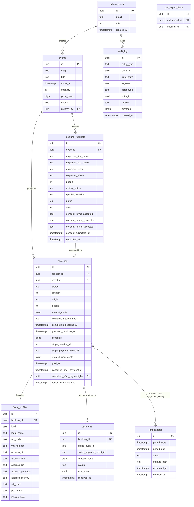

# Cooker Loft V1 — Database Schema

- **Purpose**: define the V1 Postgres schema on Supabase, including tables, columns, types, constraints, indexes, foreign keys, and row-level security policies.
- **Scope**: schema for the booking lifecycle, fiscal data, payments, XML exports, and audit log.
- **Out of scope**: data migrations from any legacy system, analytics tables, and per-participant data (see [NON_GOALS.md](./NON_GOALS.md)).
- **Owner**: Cooker Loft technical lead.
- **Last updated**: 2026-05-20.

---

## 1. Conventions

- **Database**: Postgres (Supabase).
- **IDs**: `uuid` primary keys, generated with `gen_random_uuid()` (pgcrypto).
- **Timestamps**: `timestamptz`, default `now()`, never null where applicable.
- **Money**: stored as **integer cents** in `bigint` columns. Never store money as floats. Currency is `EUR` for V1; a `currency` column exists for future-proofing but is constrained to `'EUR'`. **All money values stored in this schema are IVA inclusa (gross)**. The VAT breakdown (imponibile + imposta) is derived at XML-export time, not stored as a column. See [XML_EXPORT.md](./XML_EXPORT.md).
- **Enums**: implemented as `text` with `CHECK` constraints (Postgres native enums are harder to evolve). Allowed values are documented per column.
- **Soft deletes**: not used in V1. Records that should disappear from operational lists transition to terminal states (`rejected`, `cancelled`, `expired`, `void`) instead.
- **RLS**: enabled on **every** table. The default policy is "deny all". Explicit policies grant the minimum required access.
- **Service role**: only the server (Next.js route handlers running on Vercel) uses the Supabase service role key. The client uses the anon key, which by default sees nothing because RLS denies all.
- **Audit**: every write to `booking_requests`, `bookings`, `payments`, `xml_exports` produces an `audit_log` row via the state-machine module.

## 2. Entity-relationship diagram

## 3. Tables

### 3.1 `admin_users`

Backed by Supabase Auth. `id` matches `auth.users.id`. We store role and a denormalized email for convenience.

| Column      | Type           | Constraints                                                                                  |
|-------------|----------------|----------------------------------------------------------------------------------------------|
| `id`        | `uuid`         | PK, references `auth.users(id)` on delete cascade.                                           |
| `email`     | `text`         | Not null. Lowercased.                                                                        |
| `role`      | `text`         | Not null. `CHECK (role IN ('admin'))`. V1 has a single role.                                 |
| `created_at`| `timestamptz`  | Not null, default `now()`.                                                                   |

Indexes: PK; unique on `email`.

### 3.2 `events`

| Column        | Type          | Constraints                                                                                |
|---------------|---------------|--------------------------------------------------------------------------------------------|
| `id`          | `uuid`        | PK, default `gen_random_uuid()`.                                                           |
| `slug`        | `text`        | Not null, unique. URL-safe, lowercased, ASCII.                                             |
| `title`       | `text`        | Not null.                                                                                  |
| `description` | `text`        | Nullable.                                                                                  |
| `starts_at`   | `timestamptz` | Not null. `CHECK (starts_at > created_at)`.                                                |
| `duration_min`| `int`         | Nullable. `CHECK (duration_min IS NULL OR duration_min > 0)`.                              |
| `capacity`    | `int`         | Not null. `CHECK (capacity > 0)`.                                                          |
| `price_cents` | `bigint`      | Not null. `CHECK (price_cents > 0)`. **Per-person gross price (IVA inclusa)**. All UI labels that display this value must show the "IVA inclusa" qualifier. |
| `currency`    | `text`        | Not null, default `'EUR'`. `CHECK (currency = 'EUR')`.                                     |
| `vat_rate_bps`| `int`         | Not null, default `2200` (= 22.00%). `CHECK (vat_rate_bps >= 0 AND vat_rate_bps <= 5000)`. VAT rate in basis points (1 bp = 0.01%). Used at XML-export time to split `price_cents * people` into imponibile + imposta. Default mirrors the accountant's reference sample at `reference/xml/fattura reference.xml`. Configurable per event in case a future event uses a different rate; the accountant validates the final value. |
| `status`      | `text`        | Not null, default `'draft'`. `CHECK (status IN ('draft','published','closed','archived'))`.|
| `created_by`  | `uuid`        | FK → `admin_users(id)`. Not null.                                                          |
| `created_at`  | `timestamptz` | Not null, default `now()`.                                                                 |
| `updated_at`  | `timestamptz` | Not null, default `now()`. Maintained by trigger.                                          |

Indexes:
- Unique on `slug`.
- Btree on `(status, starts_at)` for admin listings.

### 3.3 `booking_requests`

| Column                  | Type          | Constraints                                                                                          |
|-------------------------|---------------|------------------------------------------------------------------------------------------------------|
| `id`                    | `uuid`        | PK.                                                                                                  |
| `event_id`              | `uuid`        | FK → `events(id)`. Not null.                                                                         |
| `requester_first_name`  | `text`        | Not null.                                                                                            |
| `requester_last_name`   | `text`        | Not null.                                                                                            |
| `requester_email`       | `text`        | Not null. Lowercased. Validated format.                                                              |
| `requester_phone`       | `text`        | Not null. E.164 format encouraged; minimum length validated at the application layer.                |
| `people`                | `int`         | Not null. `CHECK (people > 0)`.                                                                      |
| `dietary_notes`         | `text`        | Nullable. Free-text covering allergies, intolerances, and food needs for the entire group.           |
| `special_occasion`      | `text`        | Nullable. Free-text describing a special occasion (e.g. birthday, anniversary).                      |
| `notes`                 | `text`        | Nullable. Free-form additional notes (anything not covered by the structured fields).                |
| `status`                | `text`        | Not null, default `'pending'`. `CHECK (status IN ('pending','accepted','rejected','waitlisted','cancelled','expired'))`. |
| `source`                | `text`        | Default `'embed'`. `CHECK (source IN ('embed','admin'))`.                                            |
| `submitted_at`          | `timestamptz` | Not null, default `now()`.                                                                           |
| `decided_at`            | `timestamptz` | Nullable. Set when status moves out of `pending`.                                                    |
| `decided_by`            | `uuid`        | Nullable. FK → `admin_users(id)`.                                                                    |
| `decision_reason`       | `text`        | Nullable. Free-text reason captured at reject / waitlist / cancel time. Mirrored to `audit_log.reason`. |
| `decision_share_with_requester` | `boolean` | Not null, default `false`. **Reserved for future use; not exercised in V1.** In V1 the E3 (rejected) email body is fixed and the admin's `decision_reason` is never injected. The column stays so future versions can re-enable a "share reason with requester" flow without a migration. |
| `ip_address`            | `inet`        | Not null. Captured at submission. Doubles as consent-capture metadata for the consents stamped at the same submission. |
| `user_agent`            | `text`        | Not null. Captured at submission. Doubles as consent-capture metadata. |
| `consent_terms_accepted`        | `boolean`     | Not null, default `false`. `CHECK (consent_terms_accepted = true)`. The public form refuses to submit without the terms checkbox. |
| `consent_terms_accepted_at`     | `timestamptz` | Not null. Server-side timestamp at submission. |
| `consent_terms_version`         | `text`        | Not null. Document version string (e.g. `terms@2026-05`). Sourced from server constants. |
| `consent_privacy_accepted`      | `boolean`     | Not null, default `false`. `CHECK (consent_privacy_accepted = true)`. |
| `consent_privacy_accepted_at`   | `timestamptz` | Not null. Server-side timestamp. |
| `consent_privacy_version`       | `text`        | Not null. e.g. `privacy@2026-05`. |
| `consent_health_accepted`       | `boolean`     | Not null, default `false`. `CHECK (consent_health_accepted = true)`. Explicit consent under GDPR art. 9.2.a for processing of health/dietary data. Required at request time regardless of whether `dietary_notes` is empty (the consent covers any subsequent dietary input collected during the booking lifecycle). |
| `consent_health_accepted_at`    | `timestamptz` | Not null. |
| `consent_health_version`        | `text`        | Not null. e.g. `health-consent@2026-05`. |
| `consent_submitted_at`          | `timestamptz` | Not null. Rollup timestamp equal to the submission time of the request; surface field for queries. |

Notes:

- `dietary_notes` and `special_occasion` are captured at request time on the public form. At completion time the representative can confirm and amend them; the **booking-side** values then become the source of truth for service operations. The request-side values are preserved for audit. See [PROJECT_BRIEF.md](./PROJECT_BRIEF.md) §3 and [STATES.md](./STATES.md) §4.
- The three `consent_*_accepted` columns are enforced at three levels: client-side validation, server-side zod re-validation, and the `CHECK` constraint above. The DB constraint is the last-line defense; it makes a `false` value unrepresentable for inserted rows.
- IP and user-agent are captured server-side (from `X-Forwarded-For` and `User-Agent`), not from a client-provided payload, so they cannot be spoofed via the public form.
- Document versions are sourced from server constants (`TERMS_VERSION`, `PRIVACY_VERSION`, `HEALTH_CONSENT_VERSION`). Bumping a constant changes future submissions only; past records are untouched.
- Application-layer caps (zod): each free-text field ≤ 1000 chars; names ≤ 80 chars; phone ≤ 32 chars.
- **Rejected, cancelled, and expired requests are not deleted**: they remain queryable through the indexes below for support and history (see [PROJECT_BRIEF.md](./PROJECT_BRIEF.md) and [STATES.md](./STATES.md) §3).

Indexes:
- Btree on `(event_id, status, submitted_at)`.
- Btree on `(event_id, status)` partial on `status IN ('rejected','cancelled','expired')` to keep the "archive" view of an event responsive.
- Btree on `requester_email` for support lookups.

### 3.4 `bookings`

| Column                      | Type          | Constraints                                                                                       |
|-----------------------------|---------------|---------------------------------------------------------------------------------------------------|
| `id`                        | `uuid`        | PK.                                                                                               |
| `request_id`                | `uuid`        | FK → `booking_requests(id)`. Not null. Unique.                                                    |
| `event_id`                  | `uuid`        | FK → `events(id)`. Not null. Denormalized for query simplicity.                                   |
| `status`                    | `text`        | Not null, default `'awaiting_completion'`. `CHECK (status IN ('awaiting_completion','awaiting_payment','paid','expired','void'))`. |
| `revision`                  | `int`         | Not null, default `1`. `CHECK (revision >= 1)`. Monotonically incremented by `editBookingPrePayment` (see [STATES.md](./STATES.md) §5.2). Embedded in Stripe Checkout session metadata. The webhook handler rejects events whose `metadata.booking_revision ≠ revision`. **Cannot be edited after `status = 'paid'`** (enforced by trigger `prevent_revision_edits_after_paid`). |
| `origin`                    | `text`        | Not null, default `'direct'`. `CHECK (origin IN ('direct','waitlist'))`. Set at booking creation: `direct` when accepted from `pending`, `waitlist` when accepted from `waitlisted`. Used to select the right completion-email template variant (**E2** vs **E5**) on initial send and on amend re-send. |
| `people`                    | `int`         | Not null. `CHECK (people > 0)`. Mirrors `booking_requests.people` at acceptance time; can be amended pre-payment by `editBookingPrePayment`. |
| `amount_cents`              | `bigint`      | Not null. Computed server-side: `events.price_cents * people`. **Gross amount (IVA inclusa)**. Recomputed by `editBookingPrePayment` if `people` changes. |
| `currency`                  | `text`        | Not null, default `'EUR'`. `CHECK (currency = 'EUR')`.                                            |
| `completion_token_hash`     | `bytea`       | Not null. SHA-256 of the random token. The plaintext token never lands in the DB. **Rotated on every `editBookingPrePayment` call**: previous hash is replaced; previous URL stops working immediately. |
| `completion_token_last4`    | `text`        | Optional, for support lookups. Last 4 chars of the URL-safe token. Not sensitive in isolation. Rotated together with the hash. |
| `completion_token_used_at`  | `timestamptz` | Nullable. Set when the token is first used. Cleared on rotation.                                  |
| `completion_token_issued_at`| `timestamptz` | Not null. Set on issuance and updated on every rotation. Drives the token's TTL.                  |
| `completion_deadline_at`    | `timestamptz` | Not null. Re-derived on every token rotation (`completion_window_hours` from issuance time, bounded by event start). |
| `payment_deadline_at`       | `timestamptz` | Nullable until `awaiting_payment`. Cleared when an edit transitions back to `awaiting_completion`. |
| `special_occasion`          | `text`        | Nullable. Initialized from `booking_requests.special_occasion` at acceptance; the representative can edit at completion; the admin can edit pre-payment via `editBookingPrePayment`. The booking-side value is the source of truth for service operations. |
| `dietary_notes`             | `text`        | Nullable. Initialized from `booking_requests.dietary_notes` at acceptance; editable at completion and via pre-payment admin edits. Free text covering allergies, intolerances, and food needs. |
| `consents`                  | `jsonb`       | Nullable until completion submission. JSON document with the consent record captured at completion. Schema: `{submitted_at, ip, user_agent, terms:{value,version}, clauses_1341_1342:{value,version}, privacy:{value,version}, health:{value,version}, image_use:{value:'accept'|'decline',version}}`. All five sub-objects required when the field is set. Indexed via expression indexes if needed. |
| `legal_accepted_at`         | `timestamptz` | Nullable. Rollup of `consents->>'submitted_at'`. Set at completion submission. Kept as a column for direct SQL queries. |
| `privacy_accepted_at`       | `timestamptz` | Nullable. Same convention as `legal_accepted_at`.                                                |
| `health_consent_accepted_at`| `timestamptz` | Nullable. Same convention.                                                                       |
| `image_use_choice`          | `text`        | Nullable. `CHECK (image_use_choice IS NULL OR image_use_choice IN ('accept','decline'))`. Rollup of `consents->'image_use'->>'value'`. |
| `consent_ip`                | `inet`        | Nullable. Captured at completion submission.                                                      |
| `consent_user_agent`        | `text`        | Nullable.                                                                                         |
| `stripe_session_id`         | `text`        | Nullable. Set on Stripe session creation. Cleared (or kept and marked obsolete in `audit_log.metadata`) when revision changes. |
| `stripe_payment_intent_id`  | `text`        | Nullable. Set on webhook success.                                                                 |
| `amount_paid_cents`         | `bigint`      | Nullable. Set on webhook success. `CHECK (amount_paid_cents IS NULL OR amount_paid_cents >= 0)`. **Gross amount (IVA inclusa)**, exactly equal to the value at the time of the verified webhook. |
| `paid_at`                   | `timestamptz` | Nullable. Set on webhook success.                                                                 |
| `cancelled_after_payment_at`| `timestamptz` | Nullable. Set by `markPaidBookingOperationallyCancelled` (see [STATES.md](./STATES.md) §6). Only meaningful when `status = 'paid'`. |
| `cancelled_after_payment_by`| `uuid`        | Nullable. FK → `admin_users(id)`. Required when `cancelled_after_payment_at IS NOT NULL`.        |
| `cancelled_after_payment_reason` | `text`   | Nullable. Required when `cancelled_after_payment_at IS NOT NULL`.                                |
| `cancellation_affects_review_email` | `boolean` | Not null, default `true`. Whether the operational cancellation suppresses E9. Future toggle if the venue ever wants to still ask for a review (kept `true` in V1). |
| `review_email_sent_at`      | `timestamptz` | Nullable. Set by the daily cron after a successful Resend send of **E9** (see [STATES.md](./STATES.md) §7). At-most-once per booking. |
| `voided_at`                 | `timestamptz` | Nullable.                                                                                         |
| `void_reason`               | `text`        | Nullable.                                                                                         |
| `created_at`                | `timestamptz` | Not null, default `now()`.                                                                        |
| `updated_at`                | `timestamptz` | Not null, default `now()`. Maintained by trigger.                                                 |

Additional CHECKs:

- `CHECK (status <> 'paid' OR (stripe_payment_intent_id IS NOT NULL AND amount_paid_cents IS NOT NULL AND paid_at IS NOT NULL))`.
- `CHECK (status <> 'awaiting_payment' OR stripe_session_id IS NOT NULL)`.
- `CHECK ((cancelled_after_payment_at IS NULL) OR (status = 'paid' AND cancelled_after_payment_by IS NOT NULL AND cancelled_after_payment_reason IS NOT NULL))`.
- `CHECK ((review_email_sent_at IS NULL) OR (status = 'paid' AND cancelled_after_payment_at IS NULL))`.
- `CHECK ((consents IS NULL) OR (legal_accepted_at IS NOT NULL AND privacy_accepted_at IS NOT NULL AND health_consent_accepted_at IS NOT NULL AND image_use_choice IS NOT NULL))`.

Indexes:

- Unique on `request_id`.
- Unique on `completion_token_hash`.
- Btree on `(event_id, status)`.
- Btree on `paid_at` (used by XML export queries).
- Btree on `status` filtered to `('awaiting_completion','awaiting_payment')` (partial index for the deadlines job).
- Btree on `(status, paid_at)` filtered to `status = 'paid' AND cancelled_after_payment_at IS NULL AND review_email_sent_at IS NULL` (partial index for the daily E9 cron).
- Btree on `revision` (for diagnostic queries; low cardinality but cheap).

### 3.5 `fiscal_profiles`

A 1:1 row with `bookings`. Separated so we can apply stricter RLS to fiscal PII.

| Column            | Type    | Constraints                                                                                                 |
|-------------------|---------|-------------------------------------------------------------------------------------------------------------|
| `id`              | `uuid`  | PK.                                                                                                         |
| `booking_id`      | `uuid`  | FK → `bookings(id)` on delete cascade. Not null. Unique.                                                    |
| `kind`            | `text`  | Not null. `CHECK (kind IN ('private','company'))`.                                                          |
| `legal_name`      | `text`  | Not null. Full name for `private`, company legal name for `company`.                                        |
| `tax_code`        | `text`  | Nullable. Italian Codice Fiscale. Required for `private`.                                                   |
| `vat_number`      | `text`  | Nullable. Required for `company`.                                                                           |
| `address_street`  | `text`  | Not null.                                                                                                   |
| `address_city`    | `text`  | Not null.                                                                                                   |
| `address_zip`     | `text`  | Not null.                                                                                                   |
| `address_province`| `text`  | Nullable. Italian two-letter province code where applicable.                                                |
| `address_country` | `text`  | Not null, default `'IT'`. ISO-3166 alpha-2.                                                                 |
| `sdi_code`        | `text`  | Nullable. 7-char Codice Destinatario for `company`. If absent and `pec_email` absent, defaults `'0000000'`. |
| `pec_email`       | `text`  | Nullable.                                                                                                   |
| `invoice_note`    | `text`  | Nullable. Requested invoice description/note.                                                               |
| `created_at`      | `timestamptz` | Not null, default `now()`.                                                                            |

Validation that lives in the app layer (zod), not the DB:
- For `kind = 'private'`: `tax_code` required, `vat_number` and `sdi_code` ignored.
- For `kind = 'company'`: `vat_number` required, at least one of `sdi_code` or `pec_email` required (else default `sdi_code = '0000000'`).

Indexes:
- Unique on `booking_id`.

### 3.6 `payments`

Append-only log of payment events received from Stripe. Distinct from the booking, because a booking may have multiple Stripe events over its lifetime (e.g. `session.completed`, `payment_intent.succeeded`, future refund events).

| Column                     | Type          | Constraints                                                                                  |
|----------------------------|---------------|----------------------------------------------------------------------------------------------|
| `id`                       | `uuid`        | PK.                                                                                          |
| `booking_id`               | `uuid`        | FK → `bookings(id)`. Not null.                                                               |
| `stripe_event_id`          | `text`        | Not null. **Unique.** Used for webhook idempotency.                                          |
| `stripe_event_type`        | `text`        | Not null. e.g. `checkout.session.completed`.                                                 |
| `stripe_payment_intent_id` | `text`        | Nullable.                                                                                    |
| `stripe_session_id`        | `text`        | Nullable.                                                                                    |
| `amount_cents`             | `bigint`      | Nullable.                                                                                    |
| `currency`                 | `text`        | Nullable.                                                                                    |
| `status`                   | `text`        | Not null. `CHECK (status IN ('received','processed','ignored','error'))`.                    |
| `raw_event`                | `jsonb`       | Not null. Full event for forensic re-processing.                                             |
| `received_at`              | `timestamptz` | Not null, default `now()`.                                                                   |
| `processed_at`             | `timestamptz` | Nullable.                                                                                    |
| `error_message`            | `text`        | Nullable.                                                                                    |

Indexes:
- Unique on `stripe_event_id`.
- Btree on `booking_id`.

### 3.7 `xml_exports`

One row per generated XML batch.

| Column         | Type          | Constraints                                                                                                |
|----------------|---------------|------------------------------------------------------------------------------------------------------------|
| `id`           | `uuid`        | PK.                                                                                                        |
| `period_start` | `timestamptz` | Not null.                                                                                                  |
| `period_end`   | `timestamptz` | Not null. `CHECK (period_end > period_start)`.                                                             |
| `status`       | `text`        | Not null, default `'generating'`. `CHECK (status IN ('generating','generated','emailed','failed'))`.       |
| `storage_path` | `text`        | Nullable. Path in Supabase Storage (private bucket).                                                       |
| `recipient_email` | `text`     | Not null. Accountant email at the time of export (denormalized for audit).                                 |
| `email_message_id`| `text`     | Nullable. Resend message id.                                                                               |
| `generated_at` | `timestamptz` | Nullable.                                                                                                  |
| `emailed_at`   | `timestamptz` | Nullable.                                                                                                  |
| `error_message`| `text`        | Nullable.                                                                                                  |
| `created_at`   | `timestamptz` | Not null, default `now()`.                                                                                 |
| `created_by`   | `uuid`        | Nullable. FK → `admin_users(id)` (null for cron-triggered).                                                |

Indexes:
- Btree on `(period_start, period_end)`.
- Btree on `status`.

### 3.8 `xml_export_items`

Join table linking exports to the paid bookings included in them. Allows audit of which export covered which booking.

| Column           | Type   | Constraints                                                                  |
|------------------|--------|------------------------------------------------------------------------------|
| `id`             | `uuid` | PK.                                                                          |
| `xml_export_id`  | `uuid` | FK → `xml_exports(id)`. Not null.                                            |
| `booking_id`     | `uuid` | FK → `bookings(id)`. Not null.                                               |

Indexes:
- Unique on `(xml_export_id, booking_id)`.
- Btree on `booking_id` to find which export(s) included a given booking.

### 3.9 `audit_log`

| Column        | Type          | Constraints                                                                                                |
|---------------|---------------|------------------------------------------------------------------------------------------------------------|
| `id`          | `uuid`        | PK.                                                                                                        |
| `entity_type` | `text`        | Not null. `CHECK (entity_type IN ('booking_request','booking','event','xml_export'))`.                     |
| `entity_id`   | `uuid`        | Not null.                                                                                                  |
| `from_state`  | `text`        | Nullable (creation events).                                                                                |
| `to_state`    | `text`        | Nullable.                                                                                                  |
| `action`      | `text`        | Not null. e.g. `accept`, `reject`, `waitlist`, `complete`, `paid`, `expire`, `void`, `xml_generate`.       |
| `actor_type`  | `text`        | Not null. `CHECK (actor_type IN ('admin','representative','system','webhook'))`.                           |
| `actor_id`    | `uuid`        | Nullable.                                                                                                  |
| `reason`      | `text`        | Nullable.                                                                                                  |
| `metadata`    | `jsonb`       | Not null, default `'{}'`.                                                                                  |
| `created_at`  | `timestamptz` | Not null, default `now()`.                                                                                 |

Indexes:
- Btree on `(entity_type, entity_id, created_at)`.

### 3.10 `app_settings` (single-row config)

A single-row table for runtime configuration that the admin can edit (without a deploy).

| Column                  | Type          | Notes                                                                       |
|-------------------------|---------------|-----------------------------------------------------------------------------|
| `id`                    | `int`         | PK. `CHECK (id = 1)` to enforce single-row.                                 |
| `accountant_email`      | `text`        | Not null.                                                                   |
| `xml_export_cron_enabled` | `boolean`   | Not null, default `true`.                                                   |
| `completion_window_hours`| `int`        | Default `72`. Used to compute `completion_deadline_at`.                     |
| `payment_window_hours`  | `int`         | Default `24`. Used to compute `payment_deadline_at`.                        |
| `review_url`            | `text`        | Nullable. Google review URL used by **E9** (see [EMAILS.md](./EMAILS.md) §E9). The daily review-email cron logs a warning and skips sends when this is null. |
| `review_email_enabled`  | `boolean`     | Not null, default `true`. Emergency kill switch for **E9**.                 |
| `terms_version`         | `text`        | Not null. Current published version string (e.g. `terms@2026-05`). Recorded as `consent_terms_version` on new submissions. Bumping here only affects future submissions. |
| `privacy_version`       | `text`        | Not null. Current published privacy notice version.                         |
| `health_consent_version`| `text`        | Not null. Current published health-data consent version.                    |
| `image_use_consent_version` | `text`    | Not null. Current published image-use consent version (used at completion). |
| `clauses_1341_1342_version` | `text`    | Not null. Current published version for the artt. 1341/1342 c.c. approval text. |
| `updated_at`            | `timestamptz` | Maintained by trigger.                                                      |

## 4. Row-level security (RLS) policies

RLS is **enabled** on every table. Default is deny. The Supabase anon key has no policies granting it access to operational tables. All public-facing writes (request submission, completion submission) go through Next.js route handlers using the service role key, after server-side validation.

Roles (Supabase Auth claims):

- `anon` — unauthenticated. No DB access through RLS in V1; the service role mediates.
- `authenticated` — any signed-in Supabase Auth user. In V1, this should always also be an `admin_users` row.
- `service_role` — server only. Bypasses RLS by Supabase convention.

### 4.1 Policy summary

| Table                | `anon` (direct)  | `authenticated` admin    | `service_role` |
|----------------------|------------------|--------------------------|----------------|
| `admin_users`        | none             | select self              | full           |
| `events`             | none             | select all, insert/update/delete | full   |
| `booking_requests`   | none             | select all, update status via state machine | full |
| `bookings`           | none             | select all, no direct write    | full     |
| `fiscal_profiles`    | none             | select all                     | full     |
| `payments`           | none             | select all                     | full     |
| `xml_exports`        | none             | select all, insert (trigger export) | full |
| `xml_export_items`   | none             | select all                     | full     |
| `audit_log`          | none             | select all                     | full     |
| `app_settings`       | none             | select, update                 | full     |

### 4.2 Notes

- "Admin update via state machine" means the route handler runs under the service role; the policy table is for clarity, not for direct admin client access. Direct authenticated-client writes are not used in V1 to keep the state machine the single writer.
- Public reads (e.g. the embed page reading an event's `title`, `starts_at`, `capacity_available`) are served by a **server route** that uses the service role and returns only the safe public projection. The browser never queries Supabase directly.
- The completion page is **token-authenticated**, not Supabase-authenticated. The server validates the token, then loads the booking via the service role.

## 5. Triggers and helper functions

- `set_updated_at()`: trigger function applied to `events`, `bookings`, `app_settings` to maintain `updated_at`.
- `enforce_paid_invariants()`: trigger on `bookings` that re-asserts the `CHECK` constraint for `paid` status (defense in depth in case the constraint is ever loosened).
- `prevent_paid_edits()`: trigger on `bookings` that rejects updates to fiscal-affecting columns (`amount_cents`, `people`, `revision`) when `status = 'paid'`. The only fields that can change on a paid booking are the operational-cancellation marker fields (`cancelled_after_payment_*`), `review_email_sent_at`, and `updated_at`.
- `prevent_fiscal_edits_after_paid()`: trigger on `fiscal_profiles` that blocks updates when the related booking is `paid`.
- `prevent_revision_decrement()`: trigger on `bookings` that rejects updates where the new `revision` is `<=` the old one (`revision` is monotonically increasing).
- `enforce_operational_cancel_invariants()`: trigger on `bookings` that ensures `cancelled_after_payment_at`, `cancelled_after_payment_by`, and `cancelled_after_payment_reason` move together (either all null or all set) and only on `status = 'paid'`.

## 6. Data retention

V1 retention defaults (configurable in V2):

- `booking_requests` in terminal `rejected`/`cancelled`/`expired` states: retained 24 months for support history, then purged by an annual job.
- `bookings` in `paid` state: retained for the legal accounting retention period (10 years in Italy by default). Not auto-deleted.
- `audit_log`: retained 24 months for terminal-state entities; indefinite for `bookings` entries.
- `payments.raw_event`: retained as long as the parent `bookings` row, redacted of Stripe customer PII on export to long-term storage (out of scope V1).

## 7. Migrations

- Migrations live in `supabase/migrations/` and are applied via the Supabase CLI in CI.
- Each migration is reversible where feasible. Destructive migrations are gated behind a CI step that requires explicit approval.
- The first migration creates all tables, types, indexes, RLS policies, and triggers in a single, reviewable bundle.

## 8. Related documents

- [STATES.md](./STATES.md) — which transitions write which columns.
- [SECURITY.md](./SECURITY.md) — RLS rationale, token storage, webhook handling.
- [XML_EXPORT.md](./XML_EXPORT.md) — how `xml_exports` and `xml_export_items` are populated.
- [PROJECT_BRIEF.md](./PROJECT_BRIEF.md) — overall architecture.
