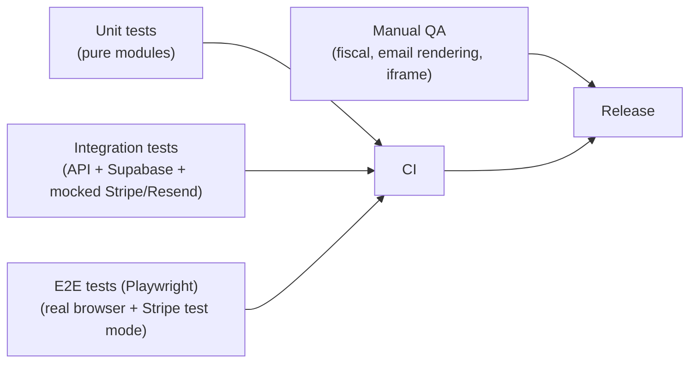

# Cooker Loft V1 — Test Plan

- **Purpose**: define how V1 is tested across unit, integration, end-to-end, and manual layers, and what CI gates we enforce before merging or deploying.
- **Scope**: testing for the V1 scope described in [PROJECT_BRIEF.md](./PROJECT_BRIEF.md).
- **Out of scope**: load and performance benchmarking beyond a light smoke level; security pen-testing beyond the checklist in [SECURITY.md](./SECURITY.md).
- **Owner**: Cooker Loft technical lead.
- **Last updated**: 2026-05-20.

---

## 1. Test layers at a glance

- **Unit** (`tests/unit/`): pure functions, no I/O. Includes the state machine, pricing, XML generator, token utilities, validation schemas.
- **Integration** (`tests/integration/`): API route handlers against a real Supabase test project, with Stripe and Resend mocked.
- **E2E** (`e2e/`): Playwright; full user journeys against a preview deployment with Stripe in test mode.
- **Manual QA**: checklists run before each release for things automation cannot reliably cover (fiscal XML look-and-feel, email rendering in real clients, iframe rendering in a real WordPress page).

## 2. Tools

- Test runner: **Vitest** (TypeScript-native, fast).
- Assertions: Vitest + a small zod-based fixture helper.
- HTTP mocks: **msw** (Mock Service Worker) for Resend; Stripe mocked via dedicated test helpers or `stripe-mock`.
- DB: a dedicated **Supabase test project** with the same migrations applied. Tests reset state between runs using a `truncate` helper limited to operational tables.
- E2E: **Playwright** (Chromium baseline; Webkit + Firefox added in Phase 8 hardening).
- Email rendering: **react-email**'s built-in dev server for visual checks; **HTML email tests** in CI verify no unresolved variables and presence of plain-text fallback.
- Accessibility: **axe-core** integrated into Playwright runs.
- Linting / typecheck: ESLint + `tsc --noEmit`.

## 3. Unit tests

### 3.1 Booking state machine (`src/modules/booking-state/`)

Required cases:

- Every allowed transition in [STATES.md](./STATES.md) is exercised end-to-end with a fake repository.
- Every disallowed transition throws a typed error (e.g. `InvalidTransition`).
- Idempotency: re-applying the same `markPaidFromWebhook` for the same `stripe_event_id` is a no-op.
- Side-effect command emission: the state machine returns an explicit list of side effects to enqueue (email send, Stripe session create, Stripe session expire), tested independently of the side-effect runner.
- Capacity enforcement: accepting a request that would exceed remaining capacity is rejected unless `override` is true; an override emits an audit reason.
- Deadlines: `expireDue(now)` only touches eligible rows.
- Edge cases: accepting a request whose event already started is blocked.
- **`editPendingRequest`** on a `pending` request:
  - Persists patched `people`, `dietary_notes`, `special_occasion` on `booking_requests`.
  - Status remains `pending`; no `bookings` row created; no completion token issued; no email side effect emitted.
  - Audit log entry written with `from_state = to_state = 'pending'` and a field-level diff.
  - Called on a non-`pending` request (e.g. `accepted`, `rejected`, `waitlisted`) throws `InvalidTransition`.
- **Post-event expiration sweep** (`expireDue(now)`):
  - Selects every `pending` and `waitlisted` request whose event `starts_at` is before `now`, transitions them to `expired`, writes one audit row each, emits **no** email side effect.
  - Already-`expired` requests are skipped.
- **`editBookingPrePayment`** on a booking in `awaiting_completion`:
  - increments `revision` by exactly 1;
  - emits `RotateCompletionToken`, `SendEmail(E2|E5, mode=amendment)` chosen by `bookings.origin`;
  - does not emit `ExpireStripeSession` if no session exists.
- `editBookingPrePayment` on `awaiting_payment`:
  - transitions back to `awaiting_completion`;
  - emits `ExpireStripeSession(stripe_session_id)` and `RotateCompletionToken` and `SendEmail(... mode=amendment)`.
- `editBookingPrePayment` on a `paid` booking throws `InvalidTransition` (paid bookings cannot be edited; only `markPaidBookingOperationallyCancelled` is allowed).
- `markPaidBookingOperationallyCancelled` on `paid`: sets `cancelled_after_payment_at/by/reason`, leaves `status='paid'`, emits no email side effect.
- `markPaidBookingOperationallyCancelled` on non-paid: throws.
- No reversal entry point exists for the operational cancellation marker in V1. Tests assert that the state machine does **not** expose any `clearPaidBookingCancellation`-style API and that the admin UI does not render an "Annulla cancellazione" affordance on `paid_cancelled` prenotazioni.
- `sendReviewRequestEmail(bookingId)` selector returns only bookings where: `status='paid'` AND `cancelled_after_payment_at IS NULL` AND `review_email_sent_at IS NULL` AND `event.starts_at < now() - 1 day`.

### 3.2 Pricing & money

- `amount = price_cents * people` is computed with integers, never floats. **All money values are IVA inclusa (gross).**
- Currency is always `EUR` in V1; non-EUR throws.
- The webhook's amount comparison handles equal amounts as success and any delta as anomaly.
- A label-formatting helper unit test asserts that every formatted price string includes the `"IVA inclusa"` qualifier.

### 3.3 XML generator (`src/modules/xml-export/`)

- Pure function: given a fixture input, returns a deterministic `{ filename, content }`.
- Snapshot tests for at least:
  - Private (B2C) booking with CF.
  - Company (B2B) booking with VAT + SDI code.
  - Company with VAT + PEC (no SDI; SDI defaults to `0000000`).
  - Private (B2C) booking that is `cancelled_after_payment` in the period (included by default, with the `operationallyCancelled` flag in the input — the XML itself is identical to a normal paid booking; the flag only affects the manifest).
- **IVA breakdown (binding)**:
  - For each fixture, `Imposta + Imponibile == ImportoTotaleDocumento` exactly (in cents).
  - Table-driven test with at least 10 `(grossCents, vatRateBps)` pairs covering: 22% common cases, edge cents (`grossCents = 1`, `100`, `123`, `12345`, large values), 10% reduced rate, 4% reduced rate, 0% (exempt). Expected `(imponibile, imposta)` is the value table agreed with the accountant.
  - Rounding rule under test: `round_half_to_even` by default; an alternative `round_half_away_from_zero` fixture is also tested to prove the constant is honored.
- Structural mapping (binding): a single golden test asserts that the emitted XML for a fixture matches the structure of `reference/xml/fattura reference.xml` for: `FormatoTrasmissione=FPR12`, `TipoDocumento=TD01`, `RegimeFiscale=RF01`, vendor identity placeholders, `AliquotaIVA` formatting, `ImportoTotaleDocumento` formatting (two decimals, `.` separator).
- Validation: missing required fields throw with precise error messages. Missing `vat_rate_bps` is a hard error (no implicit default).
- Batch + manifest: a batch of N bookings produces N XML files + a manifest with matching counts and totals. Manifest includes `operationallyCancelled` boolean column.
- Determinism: the same input produces byte-identical output across runs (matters for diff-based review by the accountant).

### 3.4 Token utilities

- Token generator produces 32 bytes of entropy; output length and charset match the URL-safe base64 spec.
- Hash function is `sha256`; same input → same hash; different inputs → different hashes.
- The plaintext token is never logged by any helper called from production paths (tested via a custom logger spy).

### 3.5 Validation schemas

- Each zod schema accepts known-good fixtures.
- Each schema rejects known-bad inputs (missing fields, wrong types, too-long strings, invalid email, invalid CF/VAT format).

## 4. Integration tests

These tests boot the Next.js route handlers in-process and call them against the Supabase test project. Each test cleans up its rows.

### 4.1 Request intake

- `POST /api/requests` with valid payload (all data fields + the three consents all `true`) → 201, row exists with `status = 'pending'` and all data fields populated.
- Missing required field (first name, last name, email, phone, or people) → 400; no row created.
- Optional fields (dietary, special occasion, notes) absent → 201; row created with nulls.
- People > event capacity → 400 with a clear error code.
- Invalid email or phone format → 400; no row created.
- Rate limit kicks in after N attempts from the same IP within the window.
- IP and User-Agent are captured server-side (not trusted from the client).
- **Consent enforcement (binding)**:
  - Any of `consent_terms_accepted`, `consent_privacy_accepted`, `consent_health_accepted` missing → 400; no row created.
  - Any of them sent as `false` → 400; no row created. (And, defensively, a direct DB insert with `false` is rejected by the CHECK constraint.)
  - On success, the row contains the three consent triplets with: server-set `accepted_at` (UTC), server-captured `ip_address`, server-captured `user_agent`, and document versions matching the current `app_settings.terms_version`, `privacy_version`, `health_consent_version`.

### 4.1b Event lifecycle (admin)

- `POST /api/admin/events` with a valid payload creates a new event in `status = 'draft'` by default. Passing `status = 'published'` in the payload publishes immediately. Any other status is rejected by the schema.
- `PATCH /api/admin/events/[id]` against a `draft` event applies the patch (title / description / starts_at / duration / capacity / price). Slug is re-derived from the title on update.
- `PATCH /api/admin/events/[id]` against a `published`, `closed`, or `archived` event → **409**, no DB mutations. The state machine refuses; this is also enforced by a CHECK / RLS / trigger guard at the DB layer.
- `POST /api/admin/events/[id]/publish` against a `draft` event transitions to `published`. A second call is a no-op (idempotent).
- `POST /api/admin/events/[id]/publish` against a non-`draft` event → 409.
- `/embed/[slug]` returns 404 for events whose `status ≠ 'published'`. A draft event's slug is therefore not yet publicly bookable.
- Audit log: every event mutation writes a row with `entity_type = 'event'`, `action ∈ {event.created, event.updated, event.published, event.closed, event.archived}` and a field-level diff for updates.

### 4.2 Admin actions

- Authenticated admin accepts a `pending` request → `bookings` row created with `revision = 1` and `origin = 'direct'`, completion token hash stored, `dietary_notes` and `special_occasion` copied from the request, `audit_log` row written, **E2** (`mode = initial`) send queued (Resend mock receives a call once).
- Reject a `pending` request → no booking row; the request stays in the DB with `status = 'rejected'` and `decision_reason` (reason required, validation rejects an empty string). **An admin list query filtered by `status = 'rejected'` returns the row.** Audit log written, **E3** send queued with a fixed body (the `decision_reason` is never injected into the email; it stays internal). The legacy `decision_share_with_requester` toggle is not exercised in V1.
- Accept and waitlist actions **do not accept a `reason` field**; passing one is rejected by the route handler / state machine schema (defensive check). Audit log records the action without a reason.
- Waitlist a `pending` request → status updated, audit log written, **E4** send queued (no completion link).
- Accept a `waitlisted` request → `bookings` row created (same as direct acceptance) with `origin = 'waitlist'`, `audit_log` row written, **E5** (`mode = initial`) send queued (not E2). The completion URL in E5 must resolve to the same handler as E2.
- **Edit a `pending` request** via `POST /api/admin/requests/[id]/edit` with a patch of `{ people, dietary_notes, special_occasion }`:
  - The row is updated; `status` remains `pending`.
  - No `bookings` row created; no completion token; no email queued.
  - `audit_log` row written with `from_state = to_state = 'pending'` and the field-level diff (only changed fields appear in the diff).
  - Same call on a non-`pending` request → 409.
- **Unified `deletePrenotazione(requestId, actor)`** (the single admin-facing destructive action; the dashboard surfaces it only as the bottom "Elimina prenotazione" button):
  - Against a `pending` request → underlying `booking_requests.status` becomes `cancelled`. No booking row exists, so no booking is touched. Audit log written. No email.
  - Against a `waitlisted` request → underlying `booking_requests.status` becomes `cancelled`. Audit log written. No email.
  - Against an `accepted` request that already has a booking in `awaiting_completion` or `awaiting_payment` → the booking is voided (`status = void`, `voided_at` and `void_reason` set), the completion token is invalidated, and the request stays in `accepted` (the booking-side void is the operative termination). Audit log written for both the request and the booking. No email.
  - Against a `paid` booking → the state machine refuses (409). The admin UI does not render the "Elimina prenotazione" affordance on paid prenotazioni.
  - In every accepted variant the resulting prenotazione is folded into the hidden `deleted` UI bucket: list queries with the standard six-status surface do not return it, but a direct DB query still finds the underlying row for audit.
- **Accept-from-waitlist confirmation (UX guard)**: the admin UI requires an explicit confirmation dialog before dispatching `acceptRequestFromWaitlist`. End-to-end test asserts that clicking "Accetta dalla lista d'attesa" opens a dialog and does not transition state until the second confirm; a `data-testid` hook is provided on the confirm button.
- Unauthorized requests (no session / non-admin) → 401/403; no DB mutations.

### 4.3 Completion submission

- Valid token + valid payload → `bookings.status = 'awaiting_payment'`, fiscal profile inserted, `bookings.consents` JSONB written with the five sub-objects (`legal`, `privacy`, `health`, `image_use`, `clauses_1341_1342`), each containing `value`, `accepted_at`, `ip_address`, `user_agent`, `document_version`. Scalar rollups (`legal_accepted_at`, `privacy_accepted_at`, `health_consent_accepted_at`, `image_use_choice`) mirror the JSONB. Stripe session creation called once with the server-computed gross amount and `metadata.booking_revision = bookings.revision`.
- **Request-data fields (`people`, `dietary_notes`, `special_occasion`) are NOT in the payload.** A submission that includes any of them in its JSON body is rejected by the zod schema (`.strict()`); the server's source of truth for those fields is the booking row, populated by the admin via `editPendingRequest` / `editBookingPrePayment`.
- Submission missing any required consent → 400; no DB mutations.
- Submission with `image_use_choice` outside `{'consent','decline'}` → 400.
- Expired token → 410, no DB mutations.
- Used token (second submission) → 409, no DB mutations.
- Malformed token → 410, no DB mutations.
- **Rotated token** (the booking has since been edited pre-payment) → 410, no DB mutations.

### 4.4 Stripe webhook

- Valid signature + new event with matching `metadata.booking_revision` → `paid` transition + E6 sent.
- Valid signature + duplicate `stripe_event_id` → no side effects; 200 returned.
- Valid signature + **mismatched `metadata.booking_revision`** (lower than `bookings.revision`) → `payments` row inserted with `status = 'ignored'`; `audit_log` row written with action `webhook.revision_mismatch_ignored`; 200 returned; `bookings.status` unchanged.
- Valid signature + missing `metadata.booking_revision` (defensive) → same as mismatch: ignored.
- Invalid signature → 400; no DB mutations; no email.
- Amount mismatch → audit row with anomaly; **no `paid` transition**; an admin alert is queued.
- Old timestamp (outside tolerance) → 400; no DB mutations.

### 4.5 Pre-payment edit flow

- `POST /api/admin/bookings/[id]/edit` (admin-authenticated) on an `awaiting_completion` booking with a field change:
  - `bookings.revision` incremented by 1.
  - `completion_token_hash` differs from the previous value; `used_at` cleared; `completion_token_issued_at` updated.
  - **The previous plaintext token, replayed against `/complete/[token]`, returns 410.**
  - The new completion URL (extracted from the queued E2/E5 amend variant) is valid and lands on the form.
  - Audit log row contains `from_revision`, `to_revision`, and a field-level diff.
- Same call on `awaiting_payment`:
  - All of the above, **plus**: `bookings.status` transitions back to `awaiting_completion`; `ExpireStripeSession` side effect emitted with the previous `stripe_session_id`.
  - Stripe mock confirms `sessions.expire` was called once.
- Same call on `paid` → 409, no DB mutations.
- Email queued is `E2` if `bookings.origin = 'direct'`, `E5` if `bookings.origin = 'waitlist'`. In both cases, `mode = 'amendment'`. The idempotency key includes `rev{revision}` and is different from the initial-mode key.

### 4.6 Obsolete-session webhook

- Set up a booking, advance to `awaiting_payment`, capture its Stripe session id, then `editBookingPrePayment` it. Replay the obsolete session's `checkout.session.completed` event:
  - `payments.status = 'ignored'`; `audit_log` row tagged `webhook_revision_mismatch`; booking does not become `paid`.
- Repeat with the new session id + correct revision: webhook succeeds; booking becomes `paid`.

### 4.7 Operational paid cancellation

- `POST /api/admin/bookings/[id]/cancel-after-payment` with reason on a `paid` booking:
  - `cancelled_after_payment_at`, `_by`, `_reason` set; `cancellation_affects_review_email = true`.
  - `status` remains `'paid'`.
  - No Stripe call, no email to the requester, no XML mutation.
  - Audit log entry written.
- Same call on a non-paid booking → 409.
- **No reversal endpoint exists in V1.** Tests assert that no `clear-cancellation` route is mounted, that the admin UI does not render an "Annulla cancellazione" button on `paid_cancelled` prenotazioni, and that any direct call against the legacy path returns 404.

### 4.8 Post-event review email (E9)

- Cron job entry point `runReviewEmailCron(now)`:
  - Selects exactly the bookings matching the §3.1 eligibility predicate; skips others.
  - Sends E9 once per eligible booking; stamps `review_email_sent_at`.
  - A second run on the same day is a no-op for already-sent bookings.
  - A booking with `cancelled_after_payment_at` set is skipped; no E9 sent even if it would otherwise be eligible.
  - When `app_settings.review_email_enabled = false` or `review_url IS NULL`: cron logs a single warning and sends nothing.
- Admin manual override `POST /api/admin/bookings/[id]/resend-review`:
  - Sends E9 even if `review_email_sent_at` is set; stamps a new `review_email_sent_at`; audit log written.
  - Refuses if `cancelled_after_payment_at` is set.

### 4.9 XML export

- `runXmlExport({ mode: 'manual_period', period })` against a fixture set including: paid bookings, one paid + operationally-cancelled booking, one already-exported booking.
  - The already-exported booking is excluded.
  - The operationally-cancelled booking appears in `manifest.csv` with `operationallyCancelled=true` and is included in `xml_export_items` by default.
  - With the admin "exclude" override applied to that booking, it is absent from `xml_export_items` and an audit row records the exclusion.
- `runXmlExport({ mode: 'manual_selection', bookingIds })`:
  - Includes exactly the requested bookings; refuses bookings already present in a prior `xml_export_items` row.
  - Bookings whose `status != 'paid'` are rejected with a precise error before any file is written.
  - The manifest reports `mode = 'manual_selection'` and the originating admin id.
- `runXmlExport({ mode: 'monthly_auto', period })` from the Vercel Cron entry point on the 1st at 03:00 `Europe/Rome`:
  - Includes every paid booking with `paid_at` in the previous calendar month that is not already exported.
  - Idempotent: re-running on the same day produces no second `xml_exports` row.
  - When the month has zero eligible bookings, writes an audit row but does **not** send E7.
- All three modes produce the same artefact shape (per-booking XML files + manifest + zip) and call into the same XML module; only the metadata on the `xml_exports` row and the E7 template branch differ.
- Per-event `vat_rate_bps` is honored; if missing → hard error before any file is written.

### 4.10 RLS smoke tests

- Anon client cannot SELECT any operational table.
- Authenticated admin client SELECTs return expected rows.
- Authenticated admin client UPDATEs on `bookings.status`, `bookings.revision`, `bookings.completion_token_hash`, `bookings.review_email_sent_at`, `bookings.cancelled_after_payment_*` are rejected (writes go through the server state machine only).

### 4.11 Email log

- Every send call records a row with template id, recipient, status.
- Idempotency keys for E2/E5 amend variants include `rev{revision}` and do not collide with `initial` variants on the same booking.
- Retries respect the backoff schedule (simulated time).

## 5. End-to-end tests (Playwright)

E2E tests run against a preview deployment (Vercel) with Stripe in test mode and a Resend test sender. They use Playwright's network interception only to **observe**, never to bypass behavior.

### 5.1 Happy path

1. Admin logs in, creates a "Test Event" (price IVA inclusa visible in the form).
2. Embed URL is fetched and the form is loaded headless.
3. Guest submits a request with the three required consent checkboxes ticked. The test asserts the submit button is disabled until all three are ticked.
4. Admin accepts the request.
5. The E2 (`mode = initial`) email is captured (via Resend test inbox or webhook mock); the link is extracted.
6. Representative opens the completion link. The page UX matches [COMPLETION_PAGE_REFERENCE.md](./COMPLETION_PAGE_REFERENCE.md). People, dietary notes, and special occasion are **displayed read-only** with the venue helper line ("Se i dati non sono corretti, scrivici a `{venue_contact_email}`…"). The test confirms the values appear and that no editable input exists for them, fills fiscal data (private kind), accepts the mandatory consent checkboxes, selects an image-use radio, submits.
7. The Stripe Checkout page loads; line description shows the event title and "IVA inclusa"; the test uses Stripe's `4242 4242 4242 4242` test card.
8. The success URL renders.
9. The webhook delivers `checkout.session.completed`; the booking becomes `paid`.
10. The admin sees the booking as paid; E6 has been delivered.
11. Admin triggers a manual XML export for the period. The preview shows the imponibile/imposta split summing exactly to the gross.
12. The accountant inbox (test) receives E7 with the zip.
13. The Playwright test advances clock to the day after the event and runs the E9 cron task; the requester inbox receives E9 containing the review URL once. A second cron run is a no-op.

A second scenario covers the **waitlist path** end-to-end:

1. Two requests are submitted for the same event in close succession; admin waitlists the second one (E4 verified).
2. Admin clicks "Accetta dalla lista d'attesa" on the waitlisted request. **The test asserts a confirmation dialog appears and that no state transition happens until the second confirm button is clicked.** After confirming, E5 (`mode = initial`) is verified and `bookings.origin = 'waitlist'`.
3. The completion link in E5 lands on the same `/complete/[token]` page and the rest of the flow proceeds identically to the happy path above.

A third scenario covers **event editing constraints**:

1. Admin creates an event as a draft, edits price and capacity, saves — both edits persist and the audit log records them.
2. Admin publishes the event. The detail page no longer renders any "Modifica" affordance.
3. A direct `PATCH /api/admin/events/[id]` from a test client returns 409.
4. The same admin attempts the same edit via the UI by navigating to `/admin/events/[id]/edit` — the page renders a disabled form with a clear "Evento pubblicato — non più modificabile" banner.

A fourth scenario covers the **unified Elimina prenotazione** action:

1. Submit three requests against an event. Admin uses the bottom "Elimina prenotazione" button on each of them in three different stages: one while still `received` (pending), one after waitlisting it, and one after accepting it and getting to `to_pay`.
2. After each deletion, the test asserts the prenotazione disappears from the dashboard list and from every event filter, but a direct DB query against `booking_requests` still finds the underlying row (with `status = 'cancelled'` for the first two, and the matched `bookings.status = 'void'` for the third). The completion link of the third one returns 410 after deletion.
3. The test asserts the admin UI does **not** render the "Elimina prenotazione" affordance on the `paid` prenotazione and on `paid_cancelled` prenotazioni.

### 5.2 Pre-payment edit & revision rotation path

This path also covers the user-facing "the data is wrong" flow: the representative cannot edit on `/complete/[token]`, so they contact the team, the team edits via admin, and a new completion link is sent.

1. Submit, accept, open completion link, fill it, get to the Stripe Checkout page; **do not pay yet**.
2. Admin edits people count from 2 to 3 on the booking detail page.
3. The test asserts:
   - The old completion URL now returns 410.
   - The old Stripe Checkout URL is expired (Stripe API confirms).
   - A new E2/E5 in `mode = amendment` is delivered with a fresh completion URL.
4. The representative opens the new URL, re-confirms data, submits, pays with the test card.
5. Booking becomes `paid` with the new amount = `price_cents * 3`.
6. The test then simulates the obsolete webhook (replay of the original `checkout.session.completed`); the system records `payments.status = 'ignored'` and `audit_log` `webhook_revision_mismatch`; the booking does not change.

### 5.3 Operational paid-cancellation path

1. Drive a booking to `paid` (as in §5.1).
2. Admin marks it as operationally cancelled with a reason.
3. The booking still shows `status = paid` with a "Cancellata dopo pagamento" badge; the requester receives no email.
4. The test advances the clock to the day after the event and runs the E9 cron task; **no E9 is sent** to this booking.
5. The XML export for the period (run later) includes the booking with `operationallyCancelled = true` in the manifest by default; the admin can optionally exclude it from the run.

### 5.3b Pre-acceptance edit on a pending request

1. Guest submits a request for 2 people with dietary notes.
2. The admin opens the request and edits people from 2 to 4 and adds an extra dietary note via the "Modifica richiesta" action.
3. The test asserts:
   - The request still has `status = 'pending'`.
   - No `bookings` row exists.
   - No transactional email was queued.
   - An `audit_log` row records the field-level diff and the admin actor.
4. The admin then accepts the request. E2 (`mode = initial`) is delivered; the resulting booking carries the patched values (people = 4, updated dietary).

### 5.4 Failure paths

- Token expired before completion → user sees "link invalid or expired".
- Payment cancelled at Stripe → user returns to a cancel page; booking remains `awaiting_payment`; can resume.
- Duplicate webhook → second delivery is a no-op (verified via DB inspection on the preview project).
- Mismatched amount (simulated via a fixture event) → booking does **not** become `paid`; anomaly is logged.
- Missing consent at submit time (simulated by removing one checkbox via DOM) → server still rejects (400); no row created.

### 5.5 Accessibility checks

- axe scan on every page visited in the happy path returns no critical issues, including the embed form (with consent checkboxes) and the completion page (with the consent block, accordion, and image-use radio).
- Keyboard navigation works on: login, event create, request review (including reject + waitlist actions), completion form (all consent controls focus-reachable), pre-payment edit dialog, paid-cancellation dialog.

## 6. Manual QA checklists

For things automation does not reliably catch.

### 6.1 Fiscal XML

- Open one XML file from a recent export in a viewer; visually inspect required fields.
- Compare structure side-by-side with `reference/xml/fattura reference.xml`; deviations are explicitly reviewed with the accountant.
- Verify `Imposta + Imponibile == ImportoTotaleDocumento` on each XML by hand on a small sample.
- Send the export to the accountant; record their feedback on schema, IVA breakdown, document type, payment mode.
- Verify filename convention.
- Verify the manifest matches and that operationally-cancelled bookings are flagged.
- Verify the accountant disclaimer is visible in the trigger UI and in E7.

### 6.2 Email rendering

- Send each required template (E2 initial + amendment, E3, E4, E5 initial + amendment, E6, E7, **E9**) to Gmail, Outlook (web + desktop), Apple Mail.
- Verify no broken images, no unresolved variables, plain-text fallback readable.
- Verify all links are absolute and HTTPS, including E9's review URL.
- Verify the amendment-mode preamble (E2/E5) is visible and uses the agreed tone.

### 6.3 WordPress iframe

- Embed the snippet on a sandbox WordPress site.
- Verify the page loads inside the iframe (CSP `frame-ancestors` correctly configured).
- Verify the three consent checkboxes render correctly inside the iframe and that their inline links open in a new tab.
- Verify the form submits successfully from inside the iframe.
- Verify responsive layout on mobile, with consent labels readable and tap targets ≥ 44px.

### 6.4 Completion page UX vs. reference

- Open `/complete/[token]` and compare side-by-side with `reference/oldPage/indicazioni.txt`.
- Verify the accordion section is closed by default and opens on demand.
- Verify the mandatory consent block uses the agreed copy and links.
- Verify the image-use radio is mandatory before submit.
- Verify the minor-attendees flow is present (if applicable in V1) and triggers the required consents.
- Verify the "IVA inclusa" qualifier appears wherever a price is displayed.

### 6.5 Stripe live-mode smoke

- Before production go-live: a real low-value payment is run end-to-end with live keys.
- Refund the payment via the Stripe dashboard afterwards (V1 does not auto-refund).
- Run a live-mode pre-payment edit on a separate test booking and confirm the obsolete-session webhook is correctly ignored in production logs.

### 6.6 Review email & paid-cancellation

- Trigger E9 manually (admin override) against a test paid booking the day after a real event and confirm receipt in the requester inbox.
- Mark a different test paid booking as operationally cancelled and confirm E9 is suppressed on the next cron tick.

## 7. Test data

- Fixtures live under `tests/fixtures/` as TypeScript factories (not raw JSON).
- The Supabase test project is seeded with: 2 admin users, 3 events (draft / published / closed) with explicit `price_cents` (IVA inclusa) and `vat_rate_bps = 2200`, and a small fleet of bookings in various states including:
  - A `rejected` request (to assert it remains listed).
  - A `cancelled` request and an `expired` request (same).
  - A `paid` booking eligible for E9.
  - A `paid` + operationally-cancelled booking.
  - An `awaiting_payment` booking with `revision = 2` (i.e. it has been edited at least once) plus its expired Stripe session id.
- Every integration test resets state through a `truncate` helper that targets only operational tables and never touches `auth.*`.

## 8. Coverage targets

V1 coverage is meaningful, not vanity:

- Unit: ≥ 90% line coverage on `src/modules/booking-state/` and `src/modules/xml-export/` (including the IVA breakdown helper); ≥ 80% on `src/schemas/` and `src/lib/`.
- Integration: every API route has at least one happy-path and one failure-path test. The pre-payment edit, paid-cancellation, and review-email cron routes each have at least three failure-path tests (per §4.5, §4.7, §4.8).
- E2E: the §5.1 happy path, §5.2 pre-payment edit path, §5.3 operational paid-cancellation path, and §5.4 failure paths are all mandatory.

Coverage is reported but not the sole gate; the gates below are.

## 9. CI gates

Every PR runs:

1. `tsc --noEmit`.
2. `eslint`.
3. `vitest run` (unit + integration).
4. `playwright test` (E2E, on a preview deployment trigger).
5. A "secrets in client bundle" check: build the app and scan the client bundle for any forbidden secret env names.
6. A "RLS smoke" check: a tiny anon-client script tries to SELECT from each operational table and asserts zero rows.
7. A "completion token absence" check: scans server logs from a synthetic completion request and asserts no token plaintext appears.
8. An "IVA inclusa label" check: a static grep across `src/components/` and `emails/` ensures every component that formats `price_cents` for display goes through the shared formatter (which always includes "IVA inclusa").
9. A "consent enforcement" check: a direct DB attempt to insert a `booking_requests` row with any consent `false` fails (asserts the CHECK constraint is in place on the test project).

A PR cannot merge to `main` without all of the above green.

## 10. Pre-release gate

Before promoting to production:

- All CI gates green on the release commit.
- §6 manual checklists signed off.
- Security checklist ([SECURITY.md](./SECURITY.md)) signed off, including the new checks on token rotation, webhook revision matching, consent capture, and operational cancellation.
- Email deliverability checklist ([EMAILS.md](./EMAILS.md)) signed off, including E9.
- `reference/xml/fattura reference.xml` accountant-validated structure has been signed off; IVA breakdown rule documented and tested.
- Stripe live keys are present in the production environment, distinct from preview keys.
- Webhook endpoint in Stripe Dashboard points to the production domain with the production signing secret.
- Vercel Cron schedules for the monthly XML export and the daily review-email job are configured in production.
- `app_settings.review_url` is set to the venue's real Google review URL; `review_email_enabled = true`.

## 11. Post-release smoke

After production deploy:

- A real booking is created and paid (small amount).
- The pre-payment edit flow is exercised at least once (admin edits the booking's people count before payment; new email and new session work; old session is expired).
- The XML export is triggered manually for the period; imponibile/imposta breakdown matches accountant expectations.
- The accountant confirms receipt of E7.
- The admin dashboard shows the booking as `paid` and as `exported`.
- The day after the event, E9 is observed in the requester's inbox (or, if the booking was operationally cancelled, its absence is observed).

## 12. Related documents

- [PROJECT_BRIEF.md](./PROJECT_BRIEF.md)
- [STATES.md](./STATES.md)
- [DB_SCHEMA.md](./DB_SCHEMA.md)
- [EMAILS.md](./EMAILS.md)
- [SECURITY.md](./SECURITY.md)
- [XML_EXPORT.md](./XML_EXPORT.md)
- [COMPLETION_PAGE_REFERENCE.md](./COMPLETION_PAGE_REFERENCE.md)
- [TASK_PLAN.md](./TASK_PLAN.md)
